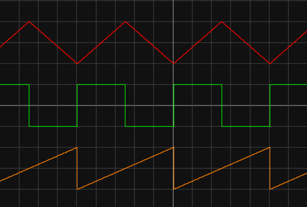

<h1 align="center">AES Synthesizer System Design</h1>

# 0.0 Promises
This is a big document, and building a synthesizer is not an easy task. I'm not saying this to scare you away, but to prepare you: this will be a challenge. That said, it will be an extremely rewarding challenge, and a great accomplishment. Synthesizers combine knowledge from across an electrical engineering education, and building one requires applying your knowledge in a way that will solidify your understanding of electronics and make you a far better engineer. Of course, any difficult journey deserves proper motivation.

By the end of this series, you will have a synthesizer consisting of four modules: an oscillator, amplifier, filter, and envelope generator (ADSR).

 The oscillator will be voltage-controlled, meaning it can be played via a power supply, Arduino, set of mechanical switches, or any other voltage output you desire. It will be capable of generating sawtooth waves from 20Hz - 3kHz, and you will have the knowledge to modify it to produce triangle and pulse-width signals, as well. In the process, you'll learn about operational amplifiers and comparators, relaxation oscillators, negative and positive feedback, hysteresis, transistor switches, 
 
 The amplifier will also be voltage-controlled. You will be able to amplify signals as small as ~10mV so that they can be played on speakers. 

# 1.0 Fundamentals

## Electronics
- Simulation & Breadboarding
	- Simulations are not perfect. Falstad < SPICE < Reality
	- Breadboards are not perfect
- Ohm's Law: V=IR. Definitions & relationships
- Voltage dividers
- AC vs DC
- Reactive Components (X, Z), Energy Storage, Frequency Dependence
	- RC Time Constants
	- Resonance / Tank Circuits
- Diodes

## Basic Waveforms
- Square / Saw / Tri / Sine
- Harmonics

## Sound & Audio Fundamentals
- Pitch as oscillation, frequency & period
- Timbre
- Range of human hearing

# The Synthesizer

## Bill of Materials (BOM)

## System Overview

On any synthesizer, we want the core functionality to create a pitch, change its volume, and shape the sound (or "timbre"). This leads every synthesizer to be made up of at least three basic subsystems:

1. Oscillator: Produces a tone at a given frequency
2. Filter: Shapes the sound
3. Amplifier: Provides gain (amplification) to change volume

One optional, yet common, additional feature found in most synths is an envelope generator, also called "ADSR". This allows for the generation of low-frequency, time-varying voltage signals which can be used as input to other subsystems.

4. ADSR: Creates a time-varying voltage envelope to modulate other subsystems

Control of each subsystem is accomplished either by modifying the circuit directly, or by introducing an external CV "control voltage". Subsystems which can be controlled by CV are referred to as "voltage-controlled", meaning we can have voltage-controlled oscillators (VCOs), filters (VCFs), and amplifiers (VCAs). 

The diagram below shows how all of these subsystems interact in a basic synthesizer. Notice the main signal path flows from oscillator → filter → amplifier, while the ADSR envelope is passed as an additional (optional) input to some of the subsystems.

_Typical synthesizer subsystems and signal flow._ [^mit_syw]*

The diagram also gives us some other information about our system, such as the existence of input control voltage, an offset, and a gate. The significance of these terms isn't extremely important right now, but will become clear as we examine each subsystem in detail. For now, simply knowing that these inputs and outputs exist is enough to inform our design process.

Finally, the diagram also indicates possibilities for more advanced synthesizers, including multiple oscillators (VCO2) and noise inputs. These add additional layers of sound, at the cost of additional complexity. These features are not included in this synthesizer build as they are not essential to sound synthesis; however, they are common modifications which enhance a synth's feature set, and are briefly discussed as [future work](#future-work).

### Design Constraints

We need to build each subsystem separately, yet each one relies on others in order to function properly. This presents a challenge because it means that decisions we make in one part of the system design can affect other systems, causing design changes, adjustments, and compromises down the line. 

One way to avoid this chaos is to outline some design constraints. For this project, we'll want to consider the following:
- Power levels (aka "rails")
- Signal levels
- Subsystem inputs & outputs

DIY synthesizer design can adhere to many arbitrary constraints; however, the popularity of synth gear has led to some conventions which we can use to inform our design. For example, the Eurorack "standard" (popularized by the company Doepfer) has led much of the synthesizer community to adopt a split-supply ±12V / GND for power; signals range between ±5V or 0-10V; envelopes typically adhere to 0-8V. [^pc_eurorack]

For simplicity, our design will use the following constraints across the entire system:
- Power Rails: ±12V & GND
- Control Voltage (CV) Signals: 0-5V 
- Output Signal: 0-5Vpp

Power and signal levels typically have the most impact to the overall system, so with these constraints, we should be able to avoid any big design problems.

## 2.1 A Basic Speaker Output Buffer
The final output stage of our synth will be ready for a speaker to play, but throughout the design process, we'll want to listen to the signal that we have. Sometimes, this signal isn't safe for a speaker to play — for example, there may be a DC offset, which desktop speakers aren't built to handle. Other times, listening to the signal might disturb the circuit, altering its behavior and changing the sound significantly. We can solve both of these problems by building an audio output buffer, which isolates the signal and removes any unsafe DC offsets without _much_ distortion.

_[Speaker buffer schematic [Falstad]](https://tinyurl.com/22qtc32k)_

We haven't explored filters, op-amps, or negative feedback yet, so don't expect to understand this circuit right away. (After we build an oscillator, though, you'll understand it completely.) For now, building the circuit and testing it using lab instruments will be challenging enough if it's your first circuit, so we'll use this as an opportunity to get familiar with building circuits, breadboarding, and troubleshooting. 

### Building the Speaker Buffer
Using the schematic above, try to draw up your own physical layout (eg. how it will look on a breadboard) before implementing the circuit on a breadboard. (You'll want to draw layouts by hand, by the way.)Notice that some things are missing from the schematic: 

- power connections
- IC pinout
- capacitor type
- I/O connectors (How do you plug in an aux cable for speakers?)

#### Pinouts
Here's an example breadboard layout using the LM358 and a generic TRS jack. Layouts are part-specific, so if you use different parts, you'll need to check the datasheets and adjust the pins to match!

#### Capacitor Type
If there is no signal offset, or if the offset is negative, the capacitor could be _reverse-biased_, meaning that a negative voltage is applied to the capacitor. This is a possibility because we are building a general-purpose buffer — we don't know what signals we'll listen to! Our signals will frequently have a positive DC offset, but this isn't always the case.

Therefore, the capacitor used in this circuit **must** be _non-polarized_. Avoid using electrolytics — if one lead is longer than the other, this is a likely sign that you've got a polarized capacitor!

#### I/O Connector Jack
I recommend using the STX-3000 barrel jack connector from the [BOM](#bom). (With the disclaimer that the pinout is *not* the same as in the layout below!) 

However, how did we get to this particular connector? It turns out that, even if you know that you want to use a 3.5mm audio connector, component selection is not straightforward! Check out the section on [component selection](#component-selection) for considerations on how we chose this particular part.

#### Breadboard Layout

Notes:
- Signal_In is an AC signal (eg. sine wave) and can be created using a function generator. 
	- Frequency: [20 Hz, 10 kHz]
	- Amplitude: 1Vpp
	- Offset: [0V, 8V]
- Check the TRS jack datasheet to verify the ordering of connections. The STX-3000, for example, uses the middle pin as "Sleeve", with "Tip" and "Ring" on top & bottom.
- Always test op-amp buffers to verify that the output (**Out1**) has the same voltage / signal as the input (**In1+**).
- The left "+" rail of the breadboard is unused. You could choose to connect the **Signal_In** to it for convenience.

Check the output using an oscilloscope to verify it is not too large (1Vpp) and has its DC offset removed. Do this _before_ connecting the speakers!

This is what your breadboarded circuit might look like:

If it works, congratulations! You're ready to listen to signals!

## The Filter
Given that synthesizer signal flow originates with the oscillator, it might seem that this is the best place to start. For our system design, though, we'll want to start with something simpler which lays the groundwork for more complex subsystems. The filter of a synthesizer represents an excellent starting point. As we build the filter, we will become familiar with electronics fundamentals and engineering design principles which will apply to future subsystem development, and even future system design.

## The Oscillator
The oscillator is the core of any synthesizer, generating periodic signals that we recognize as sound. There are many circuits which produce oscillations, but in general, oscillators can be categorized as either harmonic or relaxation.

| | Harmonic | Relaxation |
|---|----|----|
| **Feedback Mechanism:** | Amplification | Switching |
| **Method:** | Excites oscillations in a resonator (eg. crystal) | Repetitively charges/discharges an energy-storage device to a threshold |
| **Output:** | Sinusoidal | Non-linear (square / triangle / saw) |
| **Example:** |  |  |

While many synthesizers can output sinusoidal signals, sinusoids lack harmonics and therefore provide limited options for shaping the sound using subtractive filters. Therefore, we should look for a relaxation oscillator, which will produce a waveform that is rich in harmonics. 

Sawtooths are frequently preferred for synthesis because they contain both even and odd harmonics, giving additional flexibility when shaping signals through a filter.[^mit_syw] (For a review, refer to [Basic Waveforms](#basic-waveforms).) A sawtooth core also provides flexibility for further development down the line, as it can be processed to produce other waveforms such as rectangular and triangle waves. 

A quick Google search will provide many relaxation oscillator designs. We will use a relatively simple sawtooth core design sourced from [Moritz Klein's YouTube channel](https://www.youtube.com/watch?v=QBatvo8bCa4). However, before we are ready to understand how it works, we need to learn about comparators, op-amps, and feedback networks.

### Comparators and Op-Amps

### Building To The Triangle Core
The sawtooth core can be created via a design tweak to a simpler circuit which produces a triangle wave instead. This gives us an additional circuit, plus it is an easier circuit to examine before moving to a sawtooth core.

_[Triangle Core [Falstad]](https://tinyurl.com/22u8pzbx)_

### The Sawtooth Core
The sawtooth core begins with the simple circuit below, which consists of a single capacitor, a diode, a comparator, and a few resistors. Depending on component values, it can reach frequencies as low as 10-20Hz, and as high as several kHz.

_[Sawtooth core [Falstad]](https://tinyurl.com/279leub2)_

We want the ability to produce sound at a variable frequency; therefore, what we want is a variable oscillator which changes output frequency over the audible range of 20Hz - 20kHz. 

The term "variable" implies that something is changing, but what? There are several options when it comes to the "variable" part of a variable oscillator:
- Component values (eg. resistors, capacitors)
- Voltage
- Current

Most music synthesizers use either component values or voltages as inputs to determine the output frequency of a signal. 

Spiked capacitor: https://tinyurl.com/24br28bv

## The Amplifier

## The Envelope Generator

## Future Work
### Additional Oscillators & Noise

### Additional Modules
> Low frequency oscillators (LFOs), white noise generators, ring modulators, and glides (portamento). LFOs are used to modulate the control voltages to the other modules (VCO, VCF, and VCA) to provide tremolo or vibrato effects. White noise generators can be used as additional signal source, usually mixed with the output of the VCO to add the whoosh of a wind instrument or the the crash of a cymbal or drum. Ring modulators are basically analog multipliers that create very weird effects, but are important for synthesizing things like bell sounds. Glides are used on the inputs of VCOs to provide trombone-like slides from note to note. [^nate]

# References
[^mit_syw]: So You Want to Build a Synthesizer MIT http://web.mit.edu/klund/www/weblatex/node2.html
[^pc_eurorack]:Perfect Circuit Eurorack https://www.perfectcircuit.com/signal/eurorack-line-level
[^nate]: Nate Hatch Fender Component Selection https://www.youtube.com/watch?v=FacBtCPez2U&t=7s
