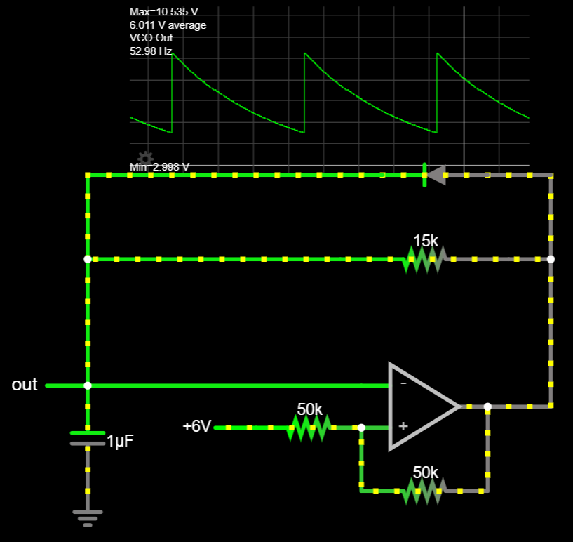

<h1 align="center">AES Synthesizer System Design</h1>

# Table of Contents
- [0.0 The Goal](#00-the-goal-and-what-to-expect)
- [1.0 Fundamentals](#10-fundamentals)
- [2.0 The Synthesizer](#20-the-synthesizer)
	- [2.0.1 Bill of Materials](#201-bill-of-materials-bom)
	- [2.0.2 System Overview](#202-system-overview)
	- [2.1 Basic Speaker Output Buffer](#21-a-basic-speaker-output-buffer)
	- [2.2 The Filter](#22-the-filter)
	- [2.3 The Oscillator](#23-the-oscillator)
	- [2.4 The Amplifier](#24-the-amplifier)
	- [2.5 The Envelope Generator (ADSR)](#25-the-envelope-generator)
	- 2.6 Putting It All Together
- 3.0 Other Stuff

# 0.0 The Goal (And What To Expect)
Building a synthesizer is difficult. I'm not saying this to scare you away, but to prepare you: this will be a challenge. That said, it will be an extremely rewarding challenge, and a great accomplishment. Synthesizers combine knowledge from across an electrical engineering education, and building one requires applying your knowledge in a way that will solidify your understanding of electronics and make you a far better engineer. Of course, any difficult journey deserves proper motivation, so this is what you can expect from this project:

By the end of this series, you will have a synthesizer consisting of four modules: an oscillator, amplifier, filter, and envelope generator (ADSR).

The filter consists of a simple high- and low-pass stage, controllable via potentiometer knobs. This system applies the concepts of impedance and frequency-dependence, and we will have to make decisions as designers about sensitivity and filter range. The filter is not voltage-controlled, although you will be able to do this by the end of this series, by applying the fundamentals we cover in other subsystems.

 The oscillator, by contrast, _is_ voltage-controlled. This means that the pitch can be set via an adjustable power supply, an Arduino, a set of mechanical switches, or any other voltage output we can control. It is capable of generating sawtooth waves from 20Hz - 3kHz, and you will have the knowledge to modify it to produce triangle and pulse-width signals, as well. In the process, you'll learn about operational amplifiers and comparators, relaxation oscillators, negative and positive feedback, hysteresis, transistor switches, as well as parasitics and other real-world implementation concerns.
 
 The amplifier is also voltage-controlled, and will amplify tiny signals (~10mV) so that they can be played on our speakers. This subsystem will teach you about differential pairs, AC analysis, the transistor "linear" operation, and component matching.

 Finally, the envelope generator is a "triggered" circuit that uses resistor-capacitor (RC) networks to create predictable, controllable time-varying voltage signals, giving the full ADSR control. By the time we get here, you'll have a lot of knowledge and practice at building circuits, so this is the most "flexible" design — you'll get to make a lot of decisions that will shape the sound and how your synth responds to user input. This section will teach concepts of gates, ADSR, RC time constants, inverting and summing op-amps, and transistor discrete logic.

 In total, this series will familiarize you with content from the introductory Circuits series, as well as EE 306/307/308, and 409. The list of topics covered makes this sound like a project for 3rd- or 4th-year students in Electrical Engineering, but the whole point of this project is that you don't need those classes (yet!) to get started building synthesizers. Most people, with a bit of effort, can understand the fundamentals of how these systems work. In the process, you'll get to build something really special: your own DIY synth.  

  
# 1.0 Fundamentals

## Electronics
- Simulation & Breadboarding
	- Simulations are not perfect. Falstad < SPICE < Reality
	- Breadboards are not perfect
- Ohm's Law: V=IR. Definitions & relationships
- Voltage dividers
- AC vs DC
- Reactive Components (X, Z), Energy Storage, Frequency Dependence
	- RC Time Constants
	- Resonance / Tank Circuits
- Diodes

## Basic Waveforms
- Square / Saw / Tri / Sine
- Harmonics

## Sound & Audio Fundamentals
- Pitch as oscillation, frequency & period
- Timbre
- Range of human hearing

# 2.0 The Synthesizer

## 2.0.1 Bill of Materials (BOM)

## 2.0.2 System Overview

On any synthesizer, we want the core functionality to create a pitch, change its volume, and shape the sound (or "timbre"). This leads every synthesizer to be made up of at least three basic subsystems:

1. Oscillator: Produces a tone at a given frequency
2. Filter: Shapes the sound
3. Amplifier: Provides gain (amplification) to change volume

One optional, yet common, additional feature found in most synths is an envelope generator, also called "ADSR". This allows for the generation of low-frequency, time-varying voltage signals which can be used as input to other subsystems.

4. ADSR: Creates a time-varying voltage envelope to modulate other subsystems

Control of each subsystem is accomplished either by modifying the circuit directly, or by introducing an external CV "control voltage". Subsystems which can be controlled by CV are referred to as "voltage-controlled", meaning we can have voltage-controlled oscillators (VCOs), filters (VCFs), and amplifiers (VCAs). 

The diagram below shows how all of these subsystems interact in a basic synthesizer. Notice the main signal path flows from oscillator → filter → amplifier, while the ADSR envelope is passed as an additional (optional) input to some of the subsystems.

_Typical synthesizer subsystems and signal flow._ [^mit_syw]*

The diagram also gives us some other information about our system, such as the existence of input control voltage, an offset, and a gate. The significance of these terms isn't extremely important right now, but will become clear as we examine each subsystem in detail. For now, simply knowing that these inputs and outputs exist is enough to inform our design process.

Finally, the diagram also indicates possibilities for more advanced synthesizers, including multiple oscillators (VCO2) and noise inputs. These add additional layers of sound, at the cost of additional complexity. These features are not included in this synthesizer build as they are not essential to sound synthesis; however, they are common modifications which enhance a synth's feature set, and are briefly discussed as [future work](#future-work).

### Design Constraints

We need to build each subsystem separately, yet each one relies on others in order to function properly. This presents a challenge because it means that decisions we make in one part of the system design can affect other systems, causing design changes, adjustments, and compromises down the line. 

One way to avoid this chaos is to outline some design constraints. For this project, we'll want to consider the following:
- Power levels (aka "rails")
- Signal levels
- Subsystem inputs & outputs

DIY synthesizer design can adhere to many arbitrary constraints; however, the popularity of synth gear has led to some conventions which we can use to inform our design. For example, the Eurorack "standard" (popularized by the company Doepfer) has led much of the synthesizer community to adopt a split-supply ±12V / GND for power; signals range between ±5V or 0-10V; envelopes typically adhere to 0-8V. [^pc_eurorack]

For simplicity, our design will use the following constraints across the entire system:
- Power Rails: ±12V & GND
- Control Voltage (CV) Signals: 0-5V 
- Output Signal: 0-5Vpp

Power and signal levels typically have the most impact to the overall system, so with these constraints, we should be able to avoid any big design problems.

## 2.1 A Basic Speaker Output Buffer
The final output stage of our synth will be ready for a speaker to play, but throughout the design process, we'll want to listen to the signal that we have. Sometimes, this signal isn't safe for a speaker to play — for example, there may be a DC offset, which desktop speakers aren't built to handle. Other times, listening to the signal might disturb the circuit, altering its behavior and changing the sound significantly. We can solve both of these problems by building an audio output buffer, which isolates the signal and removes any unsafe DC offsets without _much_ distortion.

_[Speaker buffer schematic [Falstad]](https://tinyurl.com/22qtc32k)_

We haven't explored filters, op-amps, or negative feedback yet, so don't expect to understand this circuit right away. (After we build an oscillator, though, you'll understand it completely.) For now, building the circuit and testing it using lab instruments will be challenging enough if it's your first circuit, so we'll use this as an opportunity to get familiar with building circuits, breadboarding, and troubleshooting. 

### Building the Speaker Buffer
Using the schematic above, try to draw up your own physical layout (eg. how it will look on a breadboard) before implementing the circuit on a breadboard. (You'll want to draw layouts by hand, by the way.)Notice that some things are missing from the schematic: 

- power connections
- IC pinout
- capacitor type
- I/O connectors (How do you plug in an aux cable for speakers?)

#### Pinouts
Here's an example breadboard layout using the LM358 and a generic TRS jack. Layouts are part-specific, so if you use different parts, you'll need to check the datasheets and adjust the pins to match!

#### Capacitor Type
If there is no signal offset, or if the offset is negative, the capacitor could be _reverse-biased_, meaning that a negative voltage is applied to the capacitor. This is a possibility because we are building a general-purpose buffer — we don't know what signals we'll listen to! Our signals will frequently have a positive DC offset, but this isn't always the case.

Therefore, the capacitor used in this circuit **must** be _non-polarized_. Avoid using electrolytics — if one lead is longer than the other, this is a likely sign that you've got a polarized capacitor!

#### I/O Connector Jack
I recommend using the STX-3000 barrel jack connector from the [BOM](#bom). (With the disclaimer that the pinout is *not* the same as in the layout below!) 

However, how did we get to this particular connector? It turns out that, even if you know that you want to use a 3.5mm audio connector, component selection is not straightforward! Check out the section on [component selection](#component-selection) for considerations on how we chose this particular part.

#### Breadboard Layout

Notes:
- Signal_In is an AC signal (eg. sine wave) and can be created using a function generator. 
	- Frequency: [20 Hz, 10 kHz]
	- Amplitude: 1Vpp
	- Offset: [0V, 8V]
- Check the TRS jack datasheet to verify the ordering of connections. The STX-3000, for example, uses the middle pin as "Sleeve", with "Tip" and "Ring" on top & bottom.
- Always test op-amp buffers to verify that the output (**Out1**) has the same voltage / signal as the input (**In1+**).
- The left "+" rail of the breadboard is unused. You could choose to connect the **Signal_In** to it for convenience.

Check the output using an oscilloscope to verify it is not too large (1Vpp) and has its DC offset removed. Do this _before_ connecting the speakers!

This is what your breadboarded circuit might look like:

You're ready to listen to signals!

## 2.2 The Filter

**INCOMPLETE**

Given that synthesizer signal flow originates with the oscillator, it might seem that this is the best place to start. For our system design, though, we'll want to start with something simpler which lays the groundwork for more complex subsystems. The filter of a synthesizer represents an excellent starting point. As we build the filter, we will become familiar with electronics fundamentals and engineering design principles which will apply to future subsystem development, and even future system design.

## 2.3 The Oscillator
The oscillator is the core of any synthesizer, generating periodic signals that we recognize as sound. There are many circuits which produce oscillations, but in general, oscillators can be categorized as either harmonic or relaxation.

| | Harmonic | Relaxation |
|---|----|----|
| **Feedback Mechanism:** | Amplification | Switching |
| **Method:** | Excites oscillations in a resonator (eg. crystal) | Repetitively charges/discharges an energy-storage device to a threshold |
| **Output:** | Sinusoidal | Non-linear (square / triangle / saw) |
| **Example:** |  |  |

While many synthesizers can output sinusoidal signals, sinusoids lack harmonics and therefore provide limited options for shaping the sound using subtractive filters. Therefore, we will build a relaxation oscillator, which can produce a waveform that is rich in harmonics. 

Sawtooths are frequently preferred for synthesis because they contain both even and odd harmonics, giving additional flexibility when shaping signals through a filter.[^mit_syw] (For a review of waveform harmonics, refer to [Basic Waveforms](#basic-waveforms).) A sawtooth core also provides flexibility for further development down the line, as it can be processed to produce other waveforms such as rectangular and triangle waves. 

A quick Google search will provide many relaxation oscillator designs. We will use a relatively simple sawtooth core design sourced from [Moritz Klein's YouTube channel](https://www.youtube.com/watch?v=QBatvo8bCa4). In order to understand how it works, we need to learn about comparators and hysteresis.

### Comparators
Comparators can be thought of as a subset of a more general device we'll examine first, called an "operational amplifier." These devices have two inputs (the non-inverting **In+**, and the inverting input **In-**) and a single output (**Out**), and are represented in schematics by a triangle like so: 

[//]: # (http://www.ee.surrey.ac.uk/Projects/CAL/frequency-response/idealopamp.html)

The name "operational amplifier" (aka "opamp") originates from a component that can do mathematical _operations_ with amplification. Depending on its placement and configuration in the circuit, the operational amplifier can be made to perform a variety of computations, from basic arithmetic (eg. addition and subtraction) to advanced operations such as integration or differentiation. However, the output follows a simple formula which, in isolation, provides a principle of operation for us to understand:

$$V_{out} = A_{opamp}*(V_+ - V_-)$$

In the ideal case, op-amps have an _amplification_ ( $A_{opamp}$ ) that is infinite, but even practical op-amps have enormous internal gain ( $A$ ≈ $10^5$ ). Therefore, the opamp functions like so: take the difference of the two input voltages, multiply it by a really big number, and output that voltage. 

You might imagine a few ways this could go:

| $V_+$ | $V_-$ | $A*(V_+ - V_-)$ | $V_{out}$ |
|-------|-------|---------------|-----------|
| 5 | 3 | $10^5 * (2)$ | $2*10^5$ |
| 3 | 5 | $10^5 * (-2)$ | $-2*10^5$ |
| -5 | 3 | $10^5 * (-8)$ | $-8*10^5$ |
| 5 | -3 | $10^5 * (8)$ | $8*10^5$ |
| -5 | -3 | $10^5 * (-2)$ | $-2*10^5$ |

In reality, the op-amp will _try_ to output the necessary voltage, but it is limited by the power supplies (the "rails"). In our case, our circuits run on ±12V, so instead of reaching voltages ~ $10^5$, the opamp in each given case above outputs either a positive or negative 12V. 

| $V_+$ | $V_-$ | $A*(V_+ - V_-)$ | $V_{out}$ |
|-------|-------|---------------|-----------|
| 5 | 3 | $10^5 * (2)$ | +12V |
| 3 | 5 | $10^5 * (-2)$ | -12V |
| -5 | 3 | $10^5 * (-8)$ | -12V |
| 5 | -3 | $10^5 * (8)$ | +12V |
| -5 | -3 | $10^5 * (-2)$ | -12V |

Notice that the output depends solely on the sign of $(V_+ - V_-)$. This setup is called a "comparator" topology, and it is this operation that the comparator excels at: the output is only "HIGH" or "LOW", and depends solely on a comparison of one input vs the other. 

Look at the figure below, and check out [this Falstad simulation](https://tinyurl.com/2pw6lrbk) of the comparator topology, to check your intuition about how this works.

_Different inputs cause the opamp output to hit either rail, depending on_ $(V_+ - V_-)$ _[[Falstad]](https://tinyurl.com/2jkduams)_

(Side-note: Falstad doesn't have a "comparator" part, and in fact, these simulations all use op-amps. However, because a comparator is a subset of operational amplifiers (where the "operation" is comparison), you can sometimes use an op-amp to represent a comparator. In fact, some designers even use op-amp ICs in place of comparators! (As we'll eventually discover, though, this can be bad practice, and if your op-amp is only being used to compare (by swinging to the rails), a comparator is a better choice.)

#### Comparators With Reference
While comparator setups could be used to compare any two voltages, typical implementations set one of the inputs as a fixed value, to which the other input is compared. For example, we can check whether a signal is higher than 3V by setting the inverting (-) input to a "trip point" of 3V. This makes $V_- = 3$, such that the output swings "high" to the positive rail when $(V_+ - V_-) = (V_+ - 3) > 0$.

_Comparator with reference at 3V. Input sweeps [-5V,5V]. [[Falstad]](https://tinyurl.com/2kqvkuxf)_

Typically, the reference level doesn't simply *exist* — that is, we have ±12V rails, but we wouldn't want to get a new power supply every time we need to make a comparison! (Eg. We might want to compare against 1V, 3V, 5V, etc.) Instead, common practice is to use [voltage dividers](#voltage-divider) or [zener diodes](#diodes) to set the comparator reference, while the other input is variable. This allows us to set any voltage within the rails as our reference.

_Setting the reference to 3V via voltage dividers [[Falstad]](https://tinyurl.com/2f42ud68)_

#### Hysteretic Comparators
What if we wanted more than one trip point? That is, what if we wanted the comparator output to swing "high" at one voltage, but swing "low" at a different voltage? This is known as "hysteresis", and will take some setup conceptually; however, physically it is simple to achieve. Importantly, this is the key to creating a relaxation oscillator!

First, we need to develop our intuition about what a voltage divider does. Imagine a voltage divider as "dividing" the voltage between two points. Typically, this is a fixed voltage rail, such as our 12V VCC, and GND; the output exists between the two resistors and depends on their ratio. However, what if we moved this second side, so that it wasn't connected to GND? In that case, the output would still be set "between" the two resistors, but with the endpoints shifted. You can see this principle demonstrated in the three voltage dividers below, where (due to the equal resistances) the output voltage is always halfway between the endpoints.

In general, given two endpoints $V_2$ and $V_1$:

$$V_{out} = V_1\frac{R_1}{R_1+R_2} + V_2\frac{R_2}{R_1 + R_2}$$

[(Click here for the simple proof!)](proof-dual-voltage-div.md)

This is important because we already have two possible outputs from our comparator: "high" & "low" (±12V). If we tie the comparator output to one end of the voltage divider, then the voltage divider will similarly shift its output. We can use this to set a changing reference value (or "trip" point) at the comparator's input.

This technique of using the output to influence one of the inputs is called "feedback". We'll dive into feedback more when we look further into op-amps, but for now, know that hysteresis uses _positive_ feedback, meaning that we must use the non-inverting (+) input as our reference.

Applying this to the comparator circuit, we arrive at a *hysteretic* comparator, with two different trip points. Just like the voltage divider above, you can see below that the non-inverting (+) reference input (red line) maintains a "divided" value between the comparator output and GND, creating a variable trip point. Open the simulation below to change the resistor ratio and see how the trip points move!

_Hysteretic comparator with trip points at ±6V. [[Falstad]](https://tinyurl.com/2k9ohuqg)_

As you might guess, because the voltage divider is symmetric about 0V, changing the resistor values will shift where this trip point occurs on both the "high" and "low" sides. These thresholds form a "hysteretic window", which are the transition threshold values that the input must reach in order to "trip" the comparator output to the other extreme. 

In addition to moving trip points nearer or further apart (expanding or collapsing the window), we can also bias the resistive divider about a point other than 0V to further alter the behavior. 

This makes the complete formula describing our trip point thresholds:

$$V_{trip,low} = V_{bias}\frac{R_{in}}{R_{in}+R_f} + V_{comp,low}\frac{R_f}{R_{in}+R_f}$$

$$V_{trip,high} = V_{bias}\frac{R_{in}}{R_{in}+R_f} + V_{comp,high}\frac{R_f}{R_{in}+R_f}$$

where
- $V_{comp} =$ comparator output voltage (at low or high, respectively)
- $R_{in} =$ input resistor (nearest the bias voltage)
- $R_f =$ feedback resistor (connecting output to input)

For example, if we set the input bias to 6V instead of 0V, then (using the formula from before) our trip points will move to:

$$V_{out,high} = 12\frac{50k}{100k} + 6\frac{50k}{100k} = 9V$$

$$V_{out,low} = -12*\frac{50k}{100k} + 6\frac{50k}{100k} = -3V$$

_Hysteretic comparator with biased reference about 6V. [[Falstad]](https://tinyurl.com/2hyqy4zb)_

Finally, we can modify the comparator output by changing its power connections from ±12V to something else. Note that this changes $V_{comp}$ appropriately, and is yet another factor altering the trip points.

### First Oscillator: The Triangle Core

It's time to make our first oscillator! We have most of the circuit already — in fact, this is the complete schematic for a basic triangle core.

_The triangle oscillator core [[Falstad]](https://tinyurl.com/2qcdnmht)_

Importantly, the above circuit uses +12V and 0V, and **not** -12V, for powering the comparator. This is important because it shifts the point of symmetry for the hysteretic window from 0V to 6V.

 You should recognize the hysteretic comparator circuit from before. As noted in the previous section, the change in power to +12V/0V alters $V_{comp,low}$ and affects the trip points. However, with the bias point set at 6V, the voltage divider in the positive feedback path is once again symmetric, so trip points are evenly spaced about 6V. 

 It may take a bit more time to process how the new circuitry creates an oscillator, but you already know everything you need to understand it.
 
 Previously, we supplied a sine input at the inverting (-) terminal, which the comparator responded to. However, we could supply any "sweeping" input, as long as it eventually passes both trip points that the comparator needs to change its output. (Go back and run the simulation, changing the input source to a triangle or sawtooth, to see that this is the case.) 
 
 The comparator always outputs either "high" or "low" — in this case, +12V or 0V — so we can think of it as creating a rudimentary voltage supply. If we connect this output to an RC network, we'll get a capacitor that charges and discharges according to an RC time constant, τ, proportional to the values of R and C. 

 

 _Connecting an RC network to the output of the comparator makes a "triangle" waveform, using the comparator as the supply. [[Falstad]](https://tinyurl.com/2qw5vgww)_
  
 This looks roughly the same as the input we've been using on the hysteretic comparator, so what if we used it the capacitor voltage to replace the voltage source? We would get a self-oscillating circuit!
 

_This is the same triangle oscillator core from before, but it should make a little more sense. [[Falstad]](https://tinyurl.com/2qcdnmht)_

 You'll find that $R_{charge}$ in the feedback path sets the oscillation frequency, by limiting current flow to the capacitor. 
 
 The trip points _also_ affect oscillation frequency by controlling how far the capacitor must charge/discharge to trip the comparator. That said, they should _not_ be used to vary the oscillation frequency. Larger hysteretic windows cause the RC response to become more "exponential" as the trip points move closer to the comparator rails. For a better "triangle" shape that looks linear, we want to set the trip points closer together, so that they occupy a smaller fraction of the RC charging/discharging graph. For example, charging a capacitor from 5V to 7V has an imperceptible curve and will appear perfectly linear.

 

_The entire RC curve is clearly not linear, but the segment from 5V to 7V is._

You can (and should) try to build this oscillator before moving on. Although we are using it as a stepping stone to a sawtooth oscillator, you could implement it as an oscillator to use in your final synth!

Despite the achievement of the triangle oscillator core, it does have some shortcomings. These don't make it useless — you could do a lot with it, and could certainly include it in the final build — but it does limit the final synth design.

Most notably, one of our goals for an oscillator should be to have voltage control, and the triangle oscillator makes this difficult because it both charges *and* discharges along the same resistor. Our path to voltage control will use transistors, and having a resistor with a single direction of current flow will make this upgrade possible.

In the next section, we'll turn the triangle core into a sawtooth oscillator.

### The Sawtooth Core

A triangle wave is symmetric — it looks the same on the "charge" and "discharge" segments of one period. A sawtooth wave is asymmetric, but we can think about how we might alter a triangle wave to look like a saw: if that wave had an infinitely-fast charge time, and a normal triangle discharge time, the triangle would become a sawtooth!

This is useful. If we can make the current flow _into_ the capacitor (during charging) _faster_ than the current flowing _out_ of the capacitor (during discharge), then we can create asymmetries in the charging and discharging times. The easiest way to do this is with a **diode**. 

Diodes allow current to flow solely in the direction they point toward, and (mostly) prevent current from flowing backward. This gives us the ability to specify unique paths for current flow during the charge and discharge phases. In particular, if we place a single diode with no resistors in its feedback path, we'll create a short-circuit that immediately charges the capacitor when the comparator output is high, yet acts like an open-circuit when the output is low. This means that the capacitor will still discharge through the 15kΩ resistor, and current will take the short-circuit path through the diode only when charging.

_Connecting a diode across the feedback path allows current to flow onto the capacitor immediately during charging, creating a sawtooth waveform. (Check out the sim to change the "sawtooth-ness" by adding resistance to the diode path.) [[Falstad]](https://tinyurl.com/2qlh8ez6)_

Because the discharge path is a resistor to 0V, we can modify the circuit slightly without changing its function much: let's connect the discharge resistor directly to GND instead of the comparator output. 

_Our first sawtooth core. [[Falstad]](https://tinyurl.com/2e4andwe)_

This isn't _exactly_ the same circuit, because now the resistor is always connected to 0V (even during the charging phase). However, the magnitude of current through the diode is so large during charging, that the discharge current is negligible by comparison. 

(Open the sim, and you'll see that there are limits to this statement. For example, if the diode resistance gets "too large" relative to the discharge path, then the capacitor can't charge enough to hit the upper trip point.)

Barring some component differences, this is approaching the sawtooth core that we'll use for our synthesizer. Depending on component values, we'll be able to make sharper "saw" edges, and reach different frequencies. At present, this core can reach frequencies around 700 Hz, but experiment with the component values in the simulation, and you'll see that this core can reach frequencies as low as 10-20Hz, and potentially as high as several kHz.

(Note: Right-click the plot in Falstad, and you can change the horizontal scale to zoom in and see higher frequencies more clearly. If you're at the right scale, it will be able to automatically calculate the frequency and display it on the scope window.)

### Build Notes from the Basic Saw Core

_**Under Construction**_

Here I'm going to put a breadboard schematic, picture of the breadboard. This is where we'll replace the "resistor" in the discharge path with a potentiometer.

Notes about:
- diode selection, and how the wrong diode can mess this up by adding capacitance and reverse current
- capacitor sizing, and how the capacitance should be low to get a sharp rise time and low discharge current

Spiked capacitor: https://tinyurl.com/24br28bv

### Adding Voltage Control
_**Under construction**_

We want the ability to produce sound at a variable frequency. While the term "variable" implies that something is changing, it's not obvious what that ought to be. Right now, we can change the frequency of the sawtooth core by modifying the resistance via a potentiometer, but luckily, this isn't our only option. Resistive control is somewhat limiting — after all, a potentiometer requires mechanical input, turning a knob or a screw with your fingers. Depending on the implementation, it would be extremely difficult, if not impossible, to rapidly change the pitch as you might with an instrument (eg. from 100Hz to 1kHz). Further, we might want to connect the oscillator to a keyboard or microcontroller, tuning it indirectly rather than with our hands. 

Both of these problems can be solved by making our oscillator voltage-controlled. However, doing this requires the introduction of a new device: the bipolar junction transistor, or BJT.

#### The Bipolar Junction Transistor

##### A Disclaimer
Transistor theory has many complexities which threaten to make the topic overwhelming and incomprehensible to newcomers. Reasonable treatment of such topics spans multiple courses and entire textbooks. Luckily, we can sidestep much of the complexity by focusing on abstractions that are "true enough" to establish functional intuitions and understanding. For all the details, check out the courses and texts linked in the [References]() at the end of this project; however, in the interest of moving quickly, we will embrace some degree of approximation that will serve our purposes.

##### BJT Anatomy & Behavior
BJTs come in two "flavors", called _npn_ and _pnp_. For now, we'll consider the npn. Looking at the schematic symbol below, you'll see that BJTs have three terminals: a collector, base, and emitter. Current flows from top to bottom, collector to emitter — notice that the "arrow" is always on the emitter, and it points in the direction of current flow. 

The base is not part of this flow path — that is, current does not flow from the collector into the base. Instead, think of the base as a "gatekeeper" controlling a valve to determine _how much current can flow_ from current to emitter. When the base is at a low voltage (relative to the emitter), it closes the valve and no current can flow; when the base has high voltage (again, relative to the emitter), the floodgates are opened and current can flow unimpeded! In this sense, a transistor is similar to a variable resistor (potentiometer), and we might think of the base as analagous to "setting" the resistance.

_A transistor and resistor, both conducting 10mA. Current flow depends on the base voltage (BJT), which sets current similar to a resistor value. [[Falstad]](https://tinyurl.com/2mfqly7z)_

Importantly, BJTs determine current flow _similar_ to resistors, but they do **not** operate via Ohm's law. For example, the resistor above has a current of 10mA because $I = \frac{10V}{1k\Omega} =$ 10mA. Setting the supply voltage to 20V would double the current to 20mA, while cutting it in half would similarly change the current to 5mA. **The BJT would not respond in the same way.**

While Ohm's law places current as proportional to voltage across a resistor, a BJT doesn't respond to voltage applied across collector to emitter, or $V_{CE}$. Instead, the formula governing current flow from collector to emitter relies on the relative voltage between base and emitter, $V_{BE}$. At 0V, the emitter-collector channel is completely closed, and most engineers consider the transistor to be fully conducting when $V_{BE}=0.7\text{ V}$. (This is certainly the maximum voltage you'll want to apply across the base-emitter terminals!) 

More specifically, when there is voltage to support it, current _approximately_[^pcheung] follows:

$$I_C = I_E = I_s e^{\frac{V_{BE}}{V_T}}$$

where

- $I_s$ = saturation current ~ $10^{-15} \text{mA}$
- $V_T$ = thermal voltage = 25mV at 20°C

We won't be using this formula explicitly, but [one key takeaway](18mv-rule.md) is that increases to $V_{BE}$ of +18mV result in doubling of the current through $I_C$.

_Increasing the base-emitter voltage by +18mV causes the collector current to double._ 

##### Configurations
In general, we will always setup BJT circuits in one of two configurations, like in the figure below:

- "Forward-active" mode:

$$V_{emitter} < V_{base} < V_{collector}$$

- "Cutoff" mode:

$$V_{base} \leq V_{collector}, V_{base} \leq V_{emitter}$$

This means we'll avoid any configuration which sets the collector voltage _below_ either the base or emitter — this mode, called "saturation", has different rules and won't be very useful to us.

_We'll always aim to use transistors in "cutoff" or "forward active" modes. Notice that the collector is the highest voltage; the base is at or above the emitter; and the emitter is at the lowest voltage._

##### Base Current & Beta
If you hovered over a BJT in any of the simulations, you might notice that there is an (almost imperceptible) current going into the base of the transistors! This current is so small (often nano- or micro-amperes) that we frequently disregard it — for example, we've been talking about the emitter and collector currents being equal $(I_C = I_E)$, when in reality, $I_E = I_C + I_B \approx I_C$. 

Despite its small size, this current is actually very useful for BJT circuit design, because in the forward-active mode, base- and collector currents are related by a device parameter called "beta" (β, or in datasheets, hFE). While BJTs _are_ voltage-controlled (by $V_{BE}$), beta gives us a way to consider how the current is controlled by thinking about _current_ instead of voltage:

$$I_C = \beta * I_B$$

Typical β values are around 100, but vary by device and even between individual transistors! However, thinking about β=100 will work well for us, on average. You can see the relationship of β acting on the BJT in the figure below, and also in the simulation below as you change the base voltage.

_β relates the current at the base to the current through the emitter and collector. Typical values for β=100. [[Falstad]](https://tinyurl.com/2frerxl6)_

#### A Voltage Controlled Saw Core

## 2.4 The Amplifier

## 2.5 The Envelope Generator

## 3.0 Future Work
### Additional Oscillators & Noise

### Additional Modules
> Low frequency oscillators (LFOs), white noise generators, ring modulators, and glides (portamento). LFOs are used to modulate the control voltages to the other modules (VCO, VCF, and VCA) to provide tremolo or vibrato effects. White noise generators can be used as additional signal source, usually mixed with the output of the VCO to add the whoosh of a wind instrument or the the crash of a cymbal or drum. Ring modulators are basically analog multipliers that create very weird effects, but are important for synthesizing things like bell sounds. Glides are used on the inputs of VCOs to provide trombone-like slides from note to note. [^nate]

# References
[^mit_syw]: So You Want to Build a Synthesizer MIT http://web.mit.edu/klund/www/weblatex/node2.html
[^pc_eurorack]:Perfect Circuit Eurorack https://www.perfectcircuit.com/signal/eurorack-line-level
[^nate]: Nate Hatch Fender Component Selection https://www.youtube.com/watch?v=FacBtCPez2U&t=7s
[^pcheung]: Pcheung's Aero notes
