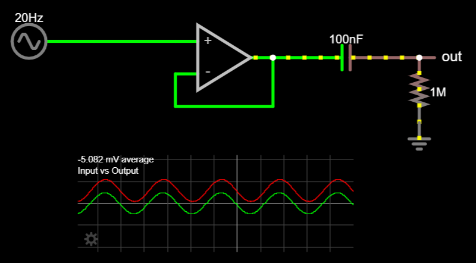
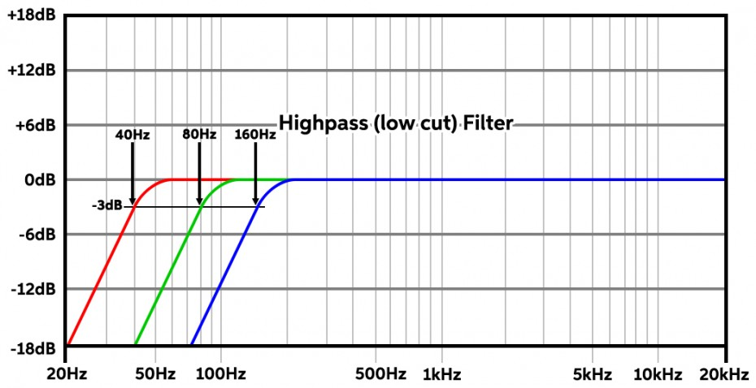
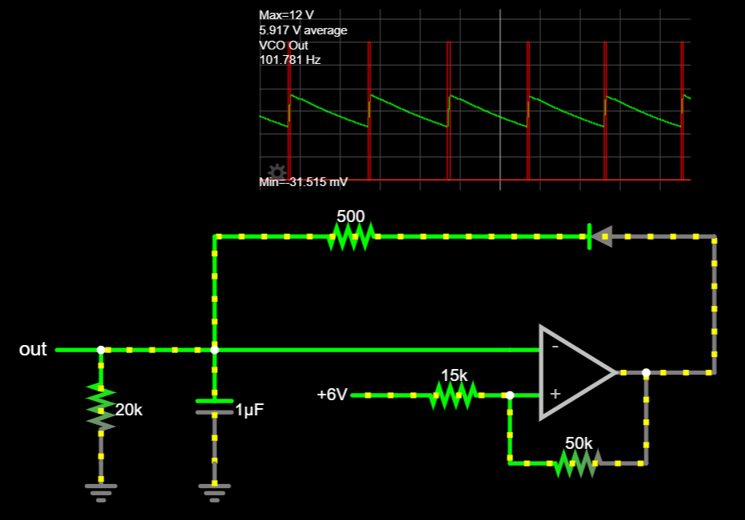
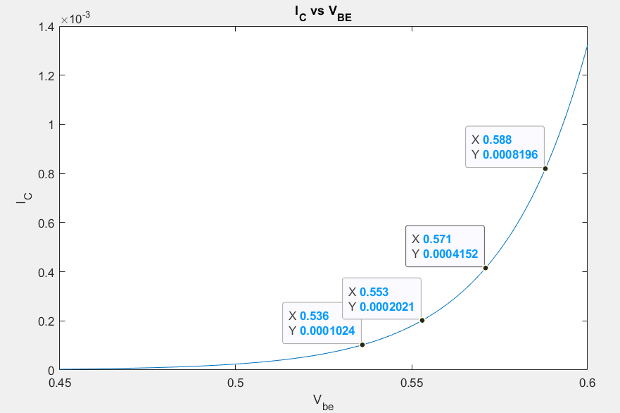

<h1 align="center">AES Synthesizer System Design</h1>

# Table of Contents
- [0.0 The Goal](#00-the-goal-and-what-to-expect)
- [1.0 Fundamentals](#10-fundamentals)
- [2.0 The Synthesizer](#20-the-synthesizer)
	- [2.0.1 Bill of Materials](#201-bill-of-materials-bom)
	- [2.0.2 System Overview](#202-system-overview)
	- [2.1 Basic Speaker Output Buffer](#21-a-basic-speaker-output-buffer)
	- [2.2 The Filter](#22-the-filter)
	- [2.3 The Oscillator](#23-the-oscillator)
	- [2.4 The Amplifier](#24-the-amplifier)
	- [2.5 The Envelope Generator (ADSR)](#25-the-envelope-generator)
	- 2.6 Putting It All Together
- 3.0 Other Stuff

# 0.0 The Goal (And What To Expect)
Building a synthesizer is difficult. I'm not saying this to scare you away, but to prepare you: this will be a challenge. That said, it will be an extremely rewarding challenge, and a great accomplishment. Synthesizers combine knowledge from across an electrical engineering education, and building one requires applying your knowledge in a way that will solidify your understanding of electronics and make you a far better engineer. Of course, any difficult journey deserves proper motivation, so this is what you can expect from this project:

By the end of this series, you will have a synthesizer consisting of four modules: an oscillator, amplifier, filter, and envelope generator (ADSR).

The filter consists of a simple high- and low-pass stage, controllable via potentiometer knobs. This system applies the concepts of impedance and frequency-dependence, and we will have to make decisions as designers about sensitivity and filter range. The filter is not voltage-controlled, although you will be able to do this by the end of this series, by applying the fundamentals we cover in other subsystems.

 The oscillator, by contrast, _is_ voltage-controlled. This means that the pitch can be set via an adjustable power supply, an Arduino, a set of mechanical switches, or any other voltage output we can control. It is capable of generating sawtooth waves from 20Hz - 3kHz, and you will have the knowledge to modify it to produce triangle and pulse-width signals, as well. In the process, you'll learn about operational amplifiers and comparators, relaxation oscillators, negative and positive feedback, hysteresis, transistor switches, as well as parasitics and other real-world implementation concerns.
 
 The amplifier is also voltage-controlled, and will amplify tiny signals (~10mV) so that they can be played on our speakers. This subsystem will teach you about differential pairs, AC analysis, the transistor "linear" operation, and component matching.

 Finally, the envelope generator is a "triggered" circuit that uses resistor-capacitor (RC) networks to create predictable, controllable time-varying voltage signals, giving the full ADSR control. By the time we get here, you'll have a lot of knowledge and practice at building circuits, so this is the most "flexible" design — you'll get to make a lot of decisions that will shape the sound and how your synth responds to user input. This section will teach concepts of gates, ADSR, RC time constants, inverting and summing op-amps, and transistor discrete logic.

 In total, this series will familiarize you with content from the introductory Circuits series, as well as EE 306/307/308, and 409. The list of topics covered makes this sound like a project for 3rd- or 4th-year students in Electrical Engineering, but the whole point of this project is that you don't need those classes (yet!) to get started building synthesizers. Most people, with a bit of effort, can understand the fundamentals of how these systems work. In the process, you'll get to build something really special: your own DIY synth.  

  
# 1.0 Fundamentals

## Electronics
- Simulation & Breadboarding
	- Simulations are not perfect. Falstad < SPICE < Reality
	- Breadboards are not perfect
- Ohm's Law: V=IR. Definitions & relationships
- Voltage dividers
- AC vs DC
- Reactive Components (X, Z), Energy Storage, Frequency Dependence
	- RC Time Constants
	- Resonance / Tank Circuits
- Diodes

### Op-Amps

However, understanding how this works is the first step 

Op-amps work by comparing two inputs (the inverting (-) and non-inverting (+) inputs). We've used op-amps before to copy ("buffer") a signal by returning the output to the input.

If we manipulate the feedback before its arrival at the inverting terminal, we can modify the values that the op-amp sees. For example, we could cut the feedback values in half via a voltage divider. 

Imagine applying 5V to the input of the following circuit. If the output starts at 0V, the op-amp will compare $(V_+ - V_-) = 5 - 0$ and push current out in order to bring the output positive. In the buffer setup, the comparison $(V_+ - V_-) = 0$ is achieved when the output reaches 5V; however, with the voltage divider, an output of 5V will only cause 2.5V at the input! The output will continue to increase until it reads 5V at the inverting input, or 10V at the output. The "doubling" behavior holds for all practical inputs to this op-amp configuration, and more generally, an op-amp in this configuration is called a "non-inverting" op-amp. The formula for this is:

$$V_{out} = V_{in+} (1 + \frac{R_f}{R_{g}})$$

Notice that if we make $R_f = 0$ or $R_g = \infty$, the formula (and circuit) becomes the same as a buffer, following $V_{out} = V_{in+}$. 

Op-amps are incredibly useful, and we'll see them more frequently soon. However, for a voltage-controlled amplifier, they

## Basic Waveforms
- Square / Saw / Tri / Sine
- Harmonics

## Sound & Audio Fundamentals
- Pitch as oscillation, frequency & period
- Timbre
- Range of human hearing

# 2.0 The Synthesizer

## 2.0.1 Bill of Materials (BOM)

## 2.0.2 System Overview

On any synthesizer, we want the core functionality to create a pitch, change its volume, and shape the sound (or "timbre"). This leads every synthesizer to be made up of at least three basic subsystems:

1. Oscillator: Produces a tone at a given frequency
2. Filter: Shapes the sound
3. Amplifier: Provides gain (amplification) to change volume

One optional, yet common, additional feature found in most synths is an envelope generator, also called "ADSR". This allows for the generation of low-frequency, time-varying voltage signals which can be used as input to other subsystems.

4. ADSR: Creates a time-varying voltage envelope to modulate other subsystems

Control of each subsystem is accomplished either by modifying the circuit directly, or by introducing an external CV "control voltage". Subsystems which can be controlled by CV are referred to as "voltage-controlled", meaning we can have voltage-controlled oscillators (VCOs), filters (VCFs), and amplifiers (VCAs). 

The diagram below shows how all of these subsystems interact in a basic synthesizer. Notice the main signal path flows from oscillator → filter → amplifier, while the ADSR envelope is passed as an additional (optional) input to some of the subsystems.

_Typical synthesizer subsystems and signal flow._ [^mit_syw]*

The diagram also gives us some other information about our system, such as the existence of input control voltage, an offset, and a gate. The significance of these terms isn't extremely important right now, but will become clear as we examine each subsystem in detail. For now, simply knowing that these inputs and outputs exist is enough to inform our design process.

Finally, the diagram also indicates possibilities for more advanced synthesizers, including multiple oscillators (VCO2) and noise inputs. These add additional layers of sound, at the cost of additional complexity. These features are not included in this synthesizer build as they are not essential to sound synthesis; however, they are common modifications which enhance a synth's feature set, and are briefly discussed as [future work](#future-work).

### Design Constraints

We need to build each subsystem separately, yet each one relies on others in order to function properly. This presents a challenge because it means that decisions we make in one part of the system design can affect other systems, causing design changes, adjustments, and compromises down the line. 

One way to avoid this chaos is to outline some design constraints. For this project, we'll want to consider the following:
- Power levels (aka "rails")
- Signal levels
- Subsystem inputs & outputs

DIY synthesizer design can adhere to many arbitrary constraints; however, the popularity of synth gear has led to some conventions which we can use to inform our design. For example, the Eurorack "standard" (popularized by the company Doepfer) has led much of the synthesizer community to adopt a split-supply ±12V / GND for power; signals range between ±5V or 0-10V; envelopes typically adhere to 0-8V. [^pc_eurorack]

For simplicity, our design will use the following constraints across the entire system:
- Power Rails: ±12V & GND
- Control Voltage (CV) Signals: 0-5V 
- Output Signal: 0-5Vpp

Power and signal levels typically have the most impact to the overall system, so with these constraints, we should be able to avoid any big design problems.

## 2.0.3 Roadmap
_**Under construction**_

This is where I'll outline each major step that needs to be done to build each system. It acts as a checklist along the way, so people know what steps need to be done & where they are in the overall build process.

**Oscillator:**
- [ ] Triangle wave (resistive)
- [ ] Sawtooth wave (resistive)
- [ ] Add voltage control
- [ ] Input conditioning to accept 0-5V CV
- [ ] Basic thermal compensation

Etc.

## 2.1 A Basic Speaker Output Buffer
The final output stage of our synth will be ready for a speaker to play, but throughout the design process, we'll want to listen to the signal that we have. Sometimes, this signal isn't safe for a speaker to play — for example, there may be a DC offset, which desktop speakers aren't built to handle. Other times, listening to the signal might disturb the circuit, altering its behavior and changing the sound significantly. We can solve both of these problems by building an audio output buffer, which isolates the signal and removes any unsafe DC offsets without _much_ distortion.

_[Speaker buffer schematic [Falstad]](https://tinyurl.com/22qtc32k)_

We haven't explored filters, op-amps, or negative feedback yet, so don't expect to understand this circuit right away. (After we build an oscillator, though, you'll understand it completely.) For now, building the circuit and testing it using lab instruments will be challenging enough if it's your first circuit, so we'll use this as an opportunity to get familiar with building circuits, breadboarding, and troubleshooting. 

### Building the Speaker Buffer
Using the schematic above, try to draw up your own physical layout (eg. how it will look on a breadboard) before implementing the circuit on a breadboard. (You'll want to draw layouts by hand, by the way.)Notice that some things are missing from the schematic: 

- power connections
- IC pinout
- capacitor type
- I/O connectors (How do you plug in an aux cable for speakers?)

#### Pinouts
Here's an example breadboard layout using the LM358 and a generic TRS jack. Layouts are part-specific, so if you use different parts, you'll need to check the datasheets and adjust the pins to match!

#### Capacitor Type
If there is no signal offset, or if the offset is negative, the capacitor could be _reverse-biased_, meaning that a negative voltage is applied to the capacitor. This is a possibility because we are building a general-purpose buffer — we don't know what signals we'll listen to! Our signals will frequently have a positive DC offset, but this isn't always the case.

Therefore, the capacitor used in this circuit **must** be _non-polarized_. Avoid using electrolytics — if one lead is longer than the other, this is a likely sign that you've got a polarized capacitor!

#### I/O Connector Jack
I recommend using the STX-3000 barrel jack connector from the [BOM](#bom). (With the disclaimer that the pinout is *not* the same as in the layout below!) 

However, how did we get to this particular connector? It turns out that, even if you know that you want to use a 3.5mm audio connector, component selection is not straightforward! Check out the section on [component selection](#component-selection) for considerations on how we chose this particular part.

#### Breadboard Layout

Notes:
- Signal_In is an AC signal (eg. sine wave) and can be created using a function generator. 
	- Frequency: [20 Hz, 10 kHz]
	- Amplitude: 1Vpp
	- Offset: [0V, 8V]
- Check the TRS jack datasheet to verify the ordering of connections. The STX-3000, for example, uses the middle pin as "Sleeve", with "Tip" and "Ring" on top & bottom.
- Always test op-amp buffers to verify that the output (**Out1**) has the same voltage / signal as the input (**In1+**).
- The left "+" rail of the breadboard is unused. You could choose to connect the **Signal_In** to it for convenience.

Check the output using an oscilloscope to verify it is not too large (1Vpp) and has its DC offset removed. Do this _before_ connecting the speakers!

This is what your breadboarded circuit might look like:

You're ready to listen to signals!

## 2.2 The Filter

_**Under Construction**_

Given that synthesizer signal flow originates with the oscillator, it might seem that this is the best place to start. For our system design, though, we'll want to start with something simpler which lays the groundwork for more complex subsystems. The filter of a synthesizer represents an excellent starting point. As we build the filter, we will become familiar with electronics fundamentals and principles which will apply to future subsystem development, and even future system design.

With the exception of sine waves, even simple sounds are typically made of many frequencies, called "harmonics", which are combined and perceived as a single sound. Most waveforms produced by synthesizers, such as triangle, square, and sawtooth waves, are rich in harmonic content — alter the harmonics, and the sound will change. (See [sound fundamentals]() to see how this works.)   Our oscillator will produce sawtooth waves, which have both even and odd harmonics.

Many alterations to a signal are possible, including adding harmonics, changing their relative intensities, shifting their frequencies, and more; however, the simplest effect we can apply to a basic waveform is that of _subtractive_ synthesis — removing harmonic content to change a sound. Filtering is one technique to achieve subtractive manipulation, where the signal passes through a "filter" that removes some harmonics while allowing others to pass through. In this module, we will implement two basic filters, a high-pass and low-pass filter, by using a fundamental electrical circuit called an RC filter.

### The RC Low-Pass Filter
The figure below shows the schematic for an RC high-pass and low-pass filter. Consisting of only a single resistor and capacitor, RC filters are extremely easy to implement. They can be understood farily quicly by developing some intuitions about the behavior of each component. 

_High pass and low-pass RC filters._

#### Resistors
Resistors are relatively simple: they _resist_ current flow. According to Ohm's Law, the current through a resistor is proportional to its resistance and the voltage across it. Applying the "water" analogy of electricity, suppose we have current flowing at some specific flow rate. (The exact units for the rate don't matter — 1 gallon/second, 1 liter/second, etc... for electricity, we'd use Amperes, which is Coulombs (a quantity of charge, like gallons or liters) per second. Regardless, current is simply a measurement that says, "How much _stuff_ is rushing through this path per second?") If we make it more difficult for current to flow — for example, by making the pipe half as wide — we can still achieve this flow rate, but we'll have to push harder to get the same quantity of water per second. And if we don't push at all, then regardless of how wide or narrow the pipe is, water doesn't flow. 

This models the relationship between voltage, current, and resistance. Voltage is akin to pressure, causing flow from areas of high pressure to those with lower pressure. As electricity flows, its rate is determined by the difference in pressure and by how much the path resists the flow of electricity. This is neatly captured by Ohm's Law as:

$$V = IR \longleftrightarrow I = \frac{V}{R} \longleftrightarrow R = \frac{V}{I}$$

#### Capacitors
Capacitors are like tiny battery cells. As the symbol suggests, capacitors store charge on two parallel plates, which allows them to be charged to various voltages as charge is added or removed. Because current always flows "downhill" from higher voltage to lower voltage, charge will continue to accumulate on a capacitor until its voltage is equal to the charge source — a capacitor cannot be charged to a voltage higher than that which it is supplied.

>Technically, this is false — a capacitor can be charged to higher voltages using clever circuitry such as a [charge pump](https://en.wikipedia.org/wiki/Charge_pump) and various power electronics. But we won't be using capacitors in any of these configurations, and this intuition is typically only intentionally violated.

Because the accumulation of charged particles is what gives a capacitor voltage, a capacitor cannot instantaneously change its voltage. For example, a capacitor charged to 10V cannot immediately discharge to 0V — all the charges would need to leave the capacitor, and while this _can_ happen very rapidly (~nanoseconds), it still requires some finite amount of time. Additionally, this means that a capacitor cannot change its voltage without a conductive path for charges to travel along. A capacitor that is charged to 10V and removed from a circuit will retain ~10V across its terminals until a conductive pathway exists to remove them. (For this reason, large capacitors are extremely dangerous! Even if a system is disconnected from a power source, large capacitors may store charges that are simply waiting for a conductive path to discharge through.)

#### Low-Pass RC Step Response
Let's look at how the low-pass filter responds to voltage. 

Before any input voltage is applied, the capacitor has zero charge on it and the input voltage is 0V. Because there is no "pressure" difference at any point in the circuit, charge does not flow in any direction. This represents the typical starting conditions for an RC circuit. 

The figure below shows waveforms plotting input and output voltage levels when we apply a 1V power signal to the circuit. When the input jumps to 1V (pressure increase), the capacitor is still at 0V. (Remember, capacitor voltage cannot change instantly, because its voltage reflects the amount of charge it carries — which takes time to come and go.) This causes a difference in pressure across the resistor, causing a current to flow. As charge flows onto the capacitor, its voltage begins to rise — sharply, at first, and then more slowly, until the capacitor and input voltages are equal.

When we then remove the 1V source, returning the input to 0V, the capacitor is still at 1V (and holding whatever charge corresponds to this voltage). With the pressure differential across the resistor now reversed, charge flows off of the capacitor and drains across the resistor — again, sharply at first, and then more slowly, until the capacitor reaches 0V. This response to a sudden, 1V "jump" in input (called a "step") is called the circuit's "step response".

The resistor sets the rate of current flow: at extremely large resistances, charging will take a long time because the rate of charge entering the capacitor will be extremely low; by contrast, if there were no resistor, charge could rush from the input to the capacitor, charging it almost immediately! (This still takes time, but it would be almost imperceptibly quick.) With a resistor of $R=1k\Omega$, we can use Ohm's Law to calculate that when the capacitor reads 0V, the current is $I = \frac{1V-0V}{1k\Omega} = 1mA$. Increasing or decreasing the resistor size, we can make the charging/discharging time longer or shorter. 

Ohm's Law also explains why the rate of charge slows as the capacitor voltage nears 1V. While the beginning of the charging cycle has a difference of 1V across the resistor (the input is at 1V, while the capacitor is at 0V), as the capacitor charges, this difference is reduced. After 30ms, for example, the capacitor voltage is closer to 0.8V, establishing a potential difference of only 0.2V! Again, via Ohm's Law, $I = \frac{1V - 0.8V}{1k\Omega} = \frac{0.2V}{1k\Omega} = 0.2mA$. So charging rate naturally decreases as the capacitor voltage gets closer to the input voltage level. Of course, the same is true in reverse for capacitor discharging once the 1V input is removed.

The capacitor also affects the charging time, but instead of controlling the rate of current flow, the capacitor's size determines the voltage level. Capacitance quantifies the relationship between how much voltage a capacitor reads for a given amount of charge, with larger capacitors requiring more charge to reach the same voltage. Therefore, even if the resistor is sized to move charge quickly onto the capacitor, a large capacitor will take longer to read 1V because it has more "space" internally to hold charges. Getting a higher "pressure" involves a high concentration of charges, and with larger plates, we simply need more charges to achieve this same concentration. In equations, this relationship is modelled by:

$$V_C = \frac{Q}{C}$$

where Q = the amount of charge, in Coulombs. Notice that the ratio Q/C demonstrates how higher capacitance requires more charge to reach the same voltage.

Therefore, the capacitor's charging speed depends on the values of both circuit elements: the capacitor's capacitance, and the resistor's resistance. Interestingly, it does _not_ depend on the voltage applied. While it seems like higher input voltages would take more time to be reached, the current will also be higher due to the larger potential difference. As a result, capacitor charging is only dependent on the values of $R$ and $C$. The **time constant** $\tau$ is defined as $\tau=RC$, and as our simulation shows, 5 time constants $(5*\tau)$ is the amount of time required to fully charge or discharge an RC filter's output.

The simulation below shows the low-pass RC step response in full. Open the link to try the simulation on Falstad, and vary the values of R & C using the sliders at the right to see how the step response changes.

_Visualizing the step response of an RC low-pass filter. [[Click for an interactive Falstad simulation!]](https://tinyurl.com/2mpry67m)_

#### Filtering A Square Wave
Remember that a square wave is [a sum of odd sinusoid harmonics](https://linsysneuro.wordpress.com/2013/03/13/adding-sine-waves/).

_From [Linear Systems for Neuroscientists](https://linsysneuro.wordpress.com/2013/03/13/adding-sine-waves/)_

The "low-pass" filter is so-called because it allows _low_ frequencies to "pass through" to the output, blocking higher frequencies. This effect is demonstrated by passing a square wave through the low-pass filter: its upper harmonics are removed, and as it is reduced to its lowest harmonics, it begins to look more sinusoidal.

Square waves show the most obvious signs of filtering, but in general, we can imagine high-frequency content as constituting the "sharp" parts of a signal — hard edges and rapidly-changing voltages. Low-frequency content, by contrast, is smoother and slowly-changing. As more frequencies are filtered, sharp edges are smoothed, becoming more rounded until all frequency content is filtered and the magnitude decreases to 0.

#### Filter Cutoff Frequency
As our square wave's input frequency increases, the capacitor begins to "run out" of time to charge completely. Before the capacitor can reach equilibrium with the 1V input, the input drops to 0V again and the capacitor discharges. Imagine this process being taken to the extreme: instead of a square wave which pulses at 40-50 Hz, we might have a square wave as high as 5000 Hz. With each cycle taking only $T = \frac{1}{5000Hz}$ seconds, or 20us, the capacitor would barely charge or discharge at all.

This demonstrates that the filter allows some frequencies through, but attenuates higher frequencies. Changing the charging time is possible through $R$ and $C$ (via $\tau = RC$), so we adjust which frequencies are noticeably attenuated by adjusting these values. The filter's "cutoff" frequency, where it reduces harmonic content by -3dB to ~70% $(\frac{1}{\sqrt{2}})$, is determined by:

$$f_c = \frac{1}{2\pi R C} \text{Hz}$$

It's difficult to see this with a square wave because it contains many different frequencies, but switching to a sine wave input (which only has one frequency and no additional harmonics) shows it clearly. For our example circuit, $R$ = 1kΩ and $C$ =  1uF gives $f_c = 1/(2\pi (1k\Omega) (1uF)) = 159 \text{Hz}$. A 1V peak-to-peak (Vpp) sine wave at this frequency is reduced to a voltage range of [146mV, 853mV], or 707mVpp.

_This low-pass filter has a cutoff frequency of 159Hz, causing an output of 707mVpp. [[Falstad]](https://tinyurl.com/2pe8cph9)_

While we might like this cutoff to be perfect, allowing everything below 159Hz through and blocking everything above, this is impossible. (This is called a "brick-wall" or "ideal" filter.) Our filter is called a "1st-order" filter, meaning that after the -3dB cutoff, signal magnitude drops by -6dB for every doubling in pitch (an octave). This is acceptable for our purposes, although note that higher-order filters are possible and would be an excellent initial upgrade to pursue [once this synth build is complete]().

_[[From ElectronicsTutorials]](https://www.electronics-tutorials.ws/filter/filter_8.html)_

### The RC High-Pass Filter
Because of its similarity to the low-pass RC filter, we have most of the intuitions we need to understand the high-pass filter. 

The following output shows the high-pass filter's response to a 1V square wave input. The key to understanding it is making sense of a series-connected capacitor. Recall that a capacitor cannot instantaneously change the voltage across its parallel plates. Therefore, if the voltage on one side of the capacitor changes, the other side of the capacitor must also change by an equal amount. In this way, a capacitor might be thought of as similar to a flexible membrane or a flexible wall — while charges cannot pass _through_ it, any changes in their pressure will be felt on the opposite side.

>I _think_ this analogy is developed by Moritz in one of his videos, and it's probably where I first saw it. I didn't see it anywhere when I scanned his [VCF series](https://youtu.be/3tMGNI--ofU), but it's got to be somewhere around there.] 

Let's walk through the step response to understand how this behavior creates the step response shown.

Before any input is connected, we assume the capacitor has 0V across it. All nodes in the circuit are at 0V, and nothing interesting is happening.

At the moment we connect 1V at the input, the voltage at the capacitor's input jumps too. Think of this as the capacitor experiencing increased pressure at its input. In order for the capacitor to maintain 0V across it, it must also exert 1V "pressure" on everything to the right of it. This causes the initial "spike" seen at the output. The output voltage is now at higher pressure, establishing a 1V pressure difference across the resistor and causing current flow to ground. 

As current flows from the right-side capacitor plate through the resistor, the output begins to fall according to the RC time constant, until the right side of the capacitor reaches equilibrium at 0V. Importantly, in draining charges to ground, there is now (-1V) established across the capacitor.

Finally, the input drops again to 0V. This drops the capacitor's left-side voltage by 1V, back to 0V. Because the capacitor has (-1V) across its plates, dropping the left side by 1V (from 1V to 0V) must also drop the right side by 1V (from 0V to -1V). Without the 1V "pressure" flexing the capacitor wall toward the right, a vacuum of (-1V) appears at the output. This causes the second, negative "spike" seen at the output, and a (-1V) differential across the resistor to ground. 

With a -1V voltage established, current begins to flow _up_ the resistor (from higher 0V pressure to lower -1V pressure) onto the capacitor's right plate. As charges accumulate, the right side of the capacitor rises according to the RC curve, until it returns to 0V.

#### High-Pass Output
A high-pass filter's output typically looks sharper and more "jagged" than the original signal, as it allows only the highest frequency content through to the output. Applying this filter to a square wave, we get output that has more high-frequency characteristics as we increase the resistance. 

_Removing low-frequency content from a square wave with a high-pass filter. [[Falstad]](https://tinyurl.com/2gxr8ofk)_

Interestingly, [simulation shows](https://tinyurl.com/2e9pytyv) that the cutoff point (the frequency at which -3dB, or 70.7% amplitude occurs) for a high-pass filter has the same formula as a low-pass filter:

$$f_c = \frac{1}{2\pi R C} \text{Hz}$$

As a first-order filter, it also obeys the same attenuation factor, however in the opposite direction: +6db/octave. The only difference is the positive slope, which flips the direction that the filter attenuates frequencies from the cutoff point.

_From [[Sweetwater]](https://www.sweetwater.com/insync/what-is-a-highpass-filter-when-should-i-use-it/)_

### Build Notes From The Filter

_**Under construction**_

BB layout from Schematic 
Leave room for the HP filter soon!

Use a non-polarized capacitor, eg. ceramic. 

Notes about how capacitors are fixed, but we can use a potentiometer to vary cutoff

Open question for students about how they want to trade sensitivity for filter cutoff range

## 2.3 The Oscillator
The oscillator is the core of any synthesizer, generating periodic signals that we recognize as sound. There are many circuits which produce oscillations, but in general, oscillators can be categorized as either harmonic or relaxation.

| | Harmonic | Relaxation |
|---|----|----|
| **Feedback Mechanism:** | Amplification | Switching |
| **Method:** | Excites oscillations in a resonator (eg. crystal) | Repetitively charges/discharges an energy-storage device to a threshold |
| **Output:** | Sinusoidal | Non-linear (square / triangle / saw) |
| **Example:** |  |  |

While many synthesizers can output sinusoidal signals, sinusoids lack harmonics and therefore provide limited options for shaping the sound using subtractive filters. Therefore, we will build a relaxation oscillator, which can produce a waveform that is rich in harmonics. 

Sawtooths are frequently preferred for synthesis because they contain both even and odd harmonics, giving additional flexibility when shaping signals through a filter.[^mit_syw] (For a review of waveform harmonics, refer to [Basic Waveforms](#basic-waveforms).) A sawtooth core also provides flexibility for further development down the line, as it can be processed to produce other waveforms such as rectangular and triangle waves. 

A quick Google search will provide many relaxation oscillator designs. We will use a relatively simple sawtooth core design sourced from [Moritz Klein's YouTube channel](https://www.youtube.com/watch?v=QBatvo8bCa4). In order to understand how it works, we need to learn about comparators and hysteresis.

### Comparators
Comparators can be thought of as a subset of a more general device we'll examine first, called an "operational amplifier." These devices have two inputs (the non-inverting **In+**, and the inverting input **In-**) and a single output (**Out**), and are represented in schematics by a triangle like so: 

[//]: # (http://www.ee.surrey.ac.uk/Projects/CAL/frequency-response/idealopamp.html)

The name "operational amplifier" (aka "opamp") originates from a component that can do mathematical _operations_ with amplification. Depending on its placement and configuration in the circuit, the operational amplifier can be made to perform a variety of computations, from basic arithmetic (eg. addition and subtraction) to advanced operations such as integration or differentiation. However, the output follows a simple formula which, in isolation, provides a principle of operation for us to understand:

$$V_{out} = A_{opamp}*(V_+ - V_-)$$

In the ideal case, op-amps have an _amplification_ ( $A_{opamp}$ ) that is infinite, but even practical op-amps have enormous internal gain ( $A$ ≈ $10^5$ ). Therefore, the opamp functions like so: take the difference of the two input voltages, multiply it by a really big number, and output that voltage. 

You might imagine a few ways this could go:

| $V_+$ | $V_-$ | $A*(V_+ - V_-)$ | $V_{out}$ |
|-------|-------|---------------|-----------|
| 5 | 3 | $10^5 * (2)$ | $2*10^5$ |
| 3 | 5 | $10^5 * (-2)$ | $-2*10^5$ |
| -5 | 3 | $10^5 * (-8)$ | $-8*10^5$ |
| 5 | -3 | $10^5 * (8)$ | $8*10^5$ |
| -5 | -3 | $10^5 * (-2)$ | $-2*10^5$ |

In reality, the op-amp will _try_ to output the necessary voltage, but it is limited by the power supplies (the "rails"). In our case, our circuits run on ±12V, so instead of reaching voltages ~ $10^5$, the opamp in each given case above outputs either a positive or negative 12V. 

| $V_+$ | $V_-$ | $A*(V_+ - V_-)$ | $V_{out}$ |
|-------|-------|---------------|-----------|
| 5 | 3 | $10^5 * (2)$ | +12V |
| 3 | 5 | $10^5 * (-2)$ | -12V |
| -5 | 3 | $10^5 * (-8)$ | -12V |
| 5 | -3 | $10^5 * (8)$ | +12V |
| -5 | -3 | $10^5 * (-2)$ | -12V |

Notice that the output depends solely on the sign of $(V_+ - V_-)$. This setup is called a "comparator" topology, and it is this operation that the comparator excels at: the output is only "HIGH" or "LOW", and depends solely on a comparison of one input vs the other. 

Look at the figure below, and check out [this Falstad simulation](https://tinyurl.com/2pw6lrbk) of the comparator topology, to check your intuition about how this works.

_Different inputs cause the opamp output to hit either rail, depending on_ $(V_+ - V_-)$ _[[Falstad]](https://tinyurl.com/2jkduams)_

(Side-note: Falstad doesn't have a "comparator" part, and in fact, these simulations all use op-amps. However, because a comparator is a subset of operational amplifiers (where the "operation" is comparison), you can sometimes use an op-amp to represent a comparator. In fact, some designers even use op-amp ICs in place of comparators! (As we'll eventually discover, though, this can be bad practice, and if your op-amp is only being used to compare (by swinging to the rails), a comparator is a better choice.)

#### Comparators With Reference
While comparator setups could be used to compare any two voltages, typical implementations set one of the inputs as a fixed value, to which the other input is compared. For example, we can check whether a signal is higher than 3V by setting the inverting (-) input to a "trip point" of 3V. This makes $V_- = 3$, such that the output swings "high" to the positive rail when $(V_+ - V_-) = (V_+ - 3) > 0$.

_Comparator with reference at 3V. Input sweeps [-5V,5V]. [[Falstad]](https://tinyurl.com/2kqvkuxf)_

Typically, the reference level doesn't simply *exist* — that is, we have ±12V rails, but we wouldn't want to get a new power supply every time we need to make a comparison! (Eg. We might want to compare against 1V, 3V, 5V, etc.) Instead, common practice is to use [voltage dividers](#voltage-divider) or [zener diodes](#diodes) to set the comparator reference, while the other input is variable. This allows us to set any voltage within the rails as our reference.

_Setting the reference to 3V via voltage dividers [[Falstad]](https://tinyurl.com/2f42ud68)_

#### Hysteretic Comparators
What if we wanted more than one trip point? That is, what if we wanted the comparator output to swing "high" at one voltage, but swing "low" at a different voltage? This is known as "hysteresis", and will take some setup conceptually; however, physically it is simple to achieve. Importantly, this is the key to creating a relaxation oscillator!

First, we need to develop our intuition about what a voltage divider does. Imagine a voltage divider as "dividing" the voltage between two points. Typically, this is a fixed voltage rail, such as our 12V VCC, and GND; the output exists between the two resistors and depends on their ratio. However, what if we moved this second side, so that it wasn't connected to GND? In that case, the output would still be set "between" the two resistors, but with the endpoints shifted. You can see this principle demonstrated in the three voltage dividers below, where (due to the equal resistances) the output voltage is always halfway between the endpoints.

In general, given two endpoints $V_2$ and $V_1$:

$$V_{out} = V_1\frac{R_1}{R_1+R_2} + V_2\frac{R_2}{R_1 + R_2}$$

[(Click here for the simple proof!)](proof-dual-voltage-div.md)

This is important because we already have two possible outputs from our comparator: "high" & "low" (±12V). If we tie the comparator output to one end of the voltage divider, then the voltage divider will similarly shift its output. We can use this to set a changing reference value (or "trip" point) at the comparator's input.

This technique of using the output to influence one of the inputs is called "feedback". We'll dive into feedback more when we look further into op-amps, but for now, know that hysteresis uses _positive_ feedback, meaning that we must use the non-inverting (+) input as our reference.

Applying this to the comparator circuit, we arrive at a *hysteretic* comparator, with two different trip points. Just like the voltage divider above, you can see below that the non-inverting (+) reference input (red line) maintains a "divided" value between the comparator output and GND, creating a variable trip point. Open the simulation below to change the resistor ratio and see how the trip points move!

_Hysteretic comparator with trip points at ±6V. [[Falstad]](https://tinyurl.com/2k9ohuqg)_

As you might guess, because the voltage divider is symmetric about 0V, changing the resistor values will shift where this trip point occurs on both the "high" and "low" sides. These thresholds form a "hysteretic window", which are the transition threshold values that the input must reach in order to "trip" the comparator output to the other extreme. 

In addition to moving trip points nearer or further apart (expanding or collapsing the window), we can also bias the resistive divider about a point other than 0V to further alter the behavior. 

This makes the complete formula describing our trip point thresholds:

$$V_{trip,low} = V_{bias}\frac{R_{in}}{R_{in}+R_f} + V_{comp,low}\frac{R_f}{R_{in}+R_f}$$

$$V_{trip,high} = V_{bias}\frac{R_{in}}{R_{in}+R_f} + V_{comp,high}\frac{R_f}{R_{in}+R_f}$$

where
- $V_{comp} =$ comparator output voltage (at low or high, respectively)
- $R_{in} =$ input resistor (nearest the bias voltage)
- $R_f =$ feedback resistor (connecting output to input)

For example, if we set the input bias to 6V instead of 0V, then (using the formula from before) our trip points will move to:

$$V_{out,high} = 12\frac{50k}{100k} + 6\frac{50k}{100k} = 9V$$

$$V_{out,low} = -12*\frac{50k}{100k} + 6\frac{50k}{100k} = -3V$$

_Hysteretic comparator with biased reference about 6V. [[Falstad]](https://tinyurl.com/2hyqy4zb)_

Finally, we can modify the comparator output by changing its power connections from ±12V to something else. Note that this changes $V_{comp}$ appropriately, and is yet another factor altering the trip points.

### First Oscillator: The Triangle Core

It's time to make our first oscillator! We have most of the circuit already — in fact, this is the complete schematic for a basic triangle core.

_The triangle oscillator core [[Falstad]](https://tinyurl.com/2qcdnmht)_

Importantly, the above circuit uses +12V and 0V, and **not** -12V, for powering the comparator. This is important because it shifts the point of symmetry for the hysteretic window from 0V to 6V.

 You should recognize the hysteretic comparator circuit from before. As noted in the previous section, the change in power to +12V/0V alters $V_{comp,low}$ and affects the trip points. However, with the bias point set at 6V, the voltage divider in the positive feedback path is once again symmetric, so trip points are evenly spaced about 6V. 

 It may take a bit more time to process how the new circuitry creates an oscillator, but you already know everything you need to understand it.
 
 Previously, we supplied a sine input at the inverting (-) terminal, which the comparator responded to. However, we could supply any "sweeping" input, as long as it eventually passes both trip points that the comparator needs to change its output. (Go back and run the simulation, changing the input source to a triangle or sawtooth, to see that this is the case.) 
 
 The comparator always outputs either "high" or "low" — in this case, +12V or 0V — so we can think of it as creating a rudimentary voltage supply. If we connect this output to an RC network, we'll get a capacitor that charges and discharges according to an RC time constant, τ, proportional to the values of R and C. 

 

 _Connecting an RC network to the output of the comparator makes a "triangle" waveform, using the comparator as the supply. [[Falstad]](https://tinyurl.com/2qw5vgww)_
  
 This looks roughly the same as the input we've been using on the hysteretic comparator, so what if we used it the capacitor voltage to replace the voltage source? We would get a self-oscillating circuit!
 

_This is the same triangle oscillator core from before, but it should make a little more sense. [[Falstad]](https://tinyurl.com/2qcdnmht)_

 You'll find that $R_{charge}$ in the feedback path sets the oscillation frequency, by limiting current flow to the capacitor. 
 
 The trip points _also_ affect oscillation frequency by controlling how far the capacitor must charge/discharge to trip the comparator. That said, they should _not_ be used to vary the oscillation frequency. Larger hysteretic windows cause the RC response to become more "exponential" as the trip points move closer to the comparator rails. For a better "triangle" shape that looks linear, we want to set the trip points closer together, so that they occupy a smaller fraction of the RC charging/discharging graph. For example, charging a capacitor from 5V to 7V has an imperceptible curve and will appear perfectly linear.

 

_The entire RC curve is clearly not linear, but the segment from 5V to 7V is._

You can (and should) try to build this oscillator before moving on. Although we are using it as a stepping stone to a sawtooth oscillator, you could implement it as an oscillator to use in your final synth!

Despite the achievement of the triangle oscillator core, it does have some shortcomings. These don't make it useless — you could do a lot with it, and could certainly include it in the final build — but it does limit the final synth design.

Most notably, one of our goals for an oscillator should be to have voltage control, and the triangle oscillator makes this difficult because it both charges *and* discharges along the same resistor. Our path to voltage control will use transistors, and having a resistor with a single direction of current flow will make this upgrade possible.

In the next section, we'll turn the triangle core into a sawtooth oscillator.

### The Sawtooth Core

A triangle wave is symmetric — it looks the same on the "charge" and "discharge" segments of one period. A sawtooth wave is asymmetric, but we can think about how we might alter a triangle wave to look like a saw: if that wave had an infinitely-fast charge time, and a normal triangle discharge time, the triangle would become a sawtooth!

This is useful. If we can make the current flow _into_ the capacitor (during charging) _faster_ than the current flowing _out_ of the capacitor (during discharge), then we can create asymmetries in the charging and discharging times. The easiest way to do this is with a **diode**. 

Diodes allow current to flow solely in the direction they point toward, and (mostly) prevent current from flowing backward. This gives us the ability to specify unique paths for current flow during the charge and discharge phases. In particular, if we place a single diode with no resistors in its feedback path, we'll create a short-circuit that immediately charges the capacitor when the comparator output is high, yet acts like an open-circuit when the output is low. This means that the capacitor will still discharge through the 15kΩ resistor, and current will take the short-circuit path through the diode only when charging.

_Connecting a diode across the feedback path allows current to flow onto the capacitor immediately during charging, creating a sawtooth waveform. (Check out the sim to change the "sawtooth-ness" by adding resistance to the diode path.) [[Falstad]](https://tinyurl.com/2qlh8ez6)_

Because the discharge path is a resistor to 0V, we can modify the circuit slightly without changing its function much: let's connect the discharge resistor directly to GND instead of the comparator output. 

_Our first sawtooth core. [[Falstad]](https://tinyurl.com/2e4andwe)_

This isn't _exactly_ the same circuit, because now the resistor is always connected to 0V (even during the charging phase). However, the magnitude of current through the diode is so large during charging, that the discharge current is negligible by comparison. 

(Open the sim, and you'll see that there are limits to this statement. For example, if the diode resistance gets "too large" relative to the discharge path, then the capacitor can't charge enough to hit the upper trip point.)

Barring some component differences, this is approaching the sawtooth core that we'll use for our synthesizer. Depending on component values, we'll be able to make sharper "saw" edges, and reach different frequencies. At present, this core can reach frequencies around 700 Hz, but experiment with the component values in the simulation, and you'll see that this core can reach frequencies as low as 10-20Hz, and potentially as high as several kHz.

(Note: Right-click the plot in Falstad, and you can change the horizontal scale to zoom in and see higher frequencies more clearly. If you're at the right scale, it will be able to automatically calculate the frequency and display it on the scope window.)

### Build Notes from the Basic Saw Core

_**Under Construction**_

Here I'm going to put a breadboard schematic, picture of the breadboard. This is where we'll replace the "resistor" in the discharge path with a potentiometer.

Notes about:
- diode selection, and how the wrong diode can mess this up by adding capacitance and reverse current
- capacitor sizing, and how the capacitance should be low to get a sharp rise time and low discharge current

Spiked capacitor: https://tinyurl.com/24br28bv

### Adding Voltage Control
_**Under construction**_

We want the ability to produce sound at a variable frequency. While the term "variable" implies that something is changing, it's not obvious what that ought to be. Right now, we can change the frequency of the sawtooth core by modifying the resistance via a potentiometer, but luckily, this isn't our only option. Resistive control is somewhat limiting — after all, a potentiometer requires mechanical input, turning a knob or a screw with your fingers. Depending on the implementation, it would be extremely difficult, if not impossible, to rapidly change the pitch as you might with an instrument (eg. from 100Hz to 1kHz). Further, we might want to connect the oscillator to a keyboard or microcontroller, tuning it indirectly rather than with our hands. 

Both of these problems can be solved by making our oscillator voltage-controlled. However, doing this requires the introduction of a new device: the bipolar junction transistor, or BJT.

#### The Bipolar Junction Transistor

##### A Disclaimer
Transistor theory has many complexities which threaten to make the topic overwhelming and incomprehensible to newcomers. Reasonable treatment of such topics spans multiple courses and entire textbooks. Luckily, we can sidestep much of the complexity by focusing on abstractions that are "true enough" to establish functional intuitions and understanding. For all the details, check out the courses and texts linked in the [References]() at the end of this project; however, in the interest of moving quickly, we will embrace some degree of approximation that will serve our purposes.

##### BJT Anatomy & Behavior
BJTs come in two "flavors", called _npn_ and _pnp_. For now, we'll consider the npn. Looking at the schematic symbol below, you'll see that BJTs have three terminals: a collector, base, and emitter. Current flows from top to bottom, collector to emitter — notice that the "arrow" is always on the emitter, and it points in the direction of current flow. 

The base is not part of this flow path — that is, current does not flow from the collector into the base. Instead, think of the base as a "gatekeeper" controlling a valve to determine _how much current can flow_ from current to emitter. When the base is at a low voltage (relative to the emitter), it closes the valve and no current can flow; when the base has high voltage (again, relative to the emitter), the floodgates are opened and current can flow unimpeded! In this sense, a transistor is similar to a variable resistor (potentiometer), and we might think of the base as analagous to "setting" the resistance.

_A transistor and resistor, both conducting 10mA. Current flow depends on the base voltage (BJT), which sets current similar to a resistor value. [[Falstad]](https://tinyurl.com/2mfqly7z)_

Importantly, BJTs determine current flow _similar_ to resistors, but they do **not** operate via Ohm's law. For example, the resistor above has a current of 10mA because $I = \frac{10V}{1k\Omega} =$ 10mA. Setting the supply voltage to 20V would double the current to 20mA, while cutting it in half would similarly change the current to 5mA. **The BJT would not respond in the same way.**

While Ohm's law places current as proportional to voltage across a resistor, a BJT doesn't respond to voltage applied across collector to emitter, or $V_{CE}$. Instead, the formula governing current flow from collector to emitter relies on the relative voltage between base and emitter, $V_{BE}$. At 0V, the emitter-collector channel is completely closed, and most engineers consider the transistor to be fully conducting when $V_{BE}=0.7\text{ V}$. (This is certainly the maximum voltage you'll want to apply across the base-emitter terminals!) 

More specifically, when there is voltage to support it, current _approximately_[^pcheung] follows:

$$I_C = I_E = I_s e^{\frac{V_{BE}}{V_T}}$$

where

- $I_s$ = saturation current ~ $50\text{fA}$ on Falstad SPICE (femto = $10^{-15}$ )
- $V_T$ = thermal voltage = 25mV at 20°C

We won't be using this formula explicitly, but [one key takeaway](18mv-rule.md) is that increases to $V_{BE}$ of +18mV result in doubling of the current through $I_C$.

_Increasing the base-emitter voltage by +18mV causes the collector current to double._ 

##### Configurations
In general, we will always setup BJT circuits in one of two configurations, like in the figure below:

- "Forward-active" mode:

$$V_{emitter} < V_{base} < V_{collector}$$

- "Cutoff" mode:

$$V_{base} \leq V_{collector}, V_{base} \leq V_{emitter}$$

This means we'll avoid any configuration which sets the collector voltage _below_ either the base or emitter — this mode, called "saturation", has different rules and won't be very useful to us.

_We'll always aim to use transistors in "cutoff" or "forward active" modes. Notice that the collector is the highest voltage; the base is at or above the emitter; and the emitter is at the lowest voltage._

##### Base Current & Beta
If you hovered over a BJT in any of the simulations, you might notice that there is an (almost imperceptible) current going into the base of the transistors! This current is so small (often nano- or micro-amperes) that we frequently disregard it — for example, we've been talking about the emitter and collector currents being equal $(I_C = I_E)$, when in reality, $I_E = I_C + I_B \approx I_C$. 

Despite its small size, this current is actually very useful for BJT circuit design, because in the forward-active mode, base- and collector currents are related by a device parameter called "beta" (β, or in datasheets, hFE). While BJTs _are_ voltage-controlled (by $V_{BE}$), beta gives us a way to consider how the current is controlled by thinking about _current_ instead of voltage:

$$I_C = \beta * I_B$$

Typical β values are around 100, but vary by device and even between individual transistors! However, thinking about β=100 will work well for us, on average. You can see the relationship of β acting on the BJT in the figure below, and also in the simulation below as you change the base voltage.

_β relates the current at the base to the current through the emitter and collector. Typical values for β=100. [[Falstad]](https://tinyurl.com/2frerxl6)_

#### A Voltage Controlled Saw Core
Knowing how a BJT controls current allows us to replace the resistor in the capacitor discharge path with an npn BJT. All we need to do is find the base-emitter voltages which yield the same currents that the resistors provided for oscillation. This will depend on the capacitor size and comparator threshold values you use — for [this setup using a 100nF capacitor [Falstad]](https://tinyurl.com/2kaspyo2), the resistor sees currents between 10uA and 400uA for frequencies between 28Hz and 1.2kHz (Using R = [15kΩ, 700kΩ]).

Using the BJT formula from earlier, we can calculate that $I_c = 50\text{fA} *e^{\frac{0.475}{25\text{mV}}}$ ≈ 10uA, so a 475mV $V_{BE}$ is around where we'll find a 20Hz oscillation. It's only worthwhile to use this formula as a starting point: component variations mean that calculating an exact value will be useless for a physical implementation of the circuit, but it's important to have an estimate so we don't fry the circuit accidentally.

_Replacing the discharge resistor with an npn BJT provides voltage control. Changing base voltage changes frequency. [[Falstad]](https://tinyurl.com/2la3ngu7)_

Don't try building this just yet — it's too easy to fry the BJT accidentally. We'll fix that in a moment, but first, let's focus on a few observations to see what else we can learn from this circuit.

1. Recall that the resistive sawtooth core had displayed exponential curvature on the decay phase. By comparison, even with a wide hysteretic window and a slow oscillation frequency, the BJT oscillator has a perfectly linear sawtooth decay. This is because the BJT sets a _constant_ current draw (determined by $V_{BE}$), whereas the resistor forms an RC network and has a characteristic discharge curve. (Why? Because as the voltage on the capacitor drops, this reduces the "pressure" pushing current through the resistor.)  
2. We know from the BJT equation that an 18mV increase to $V_{BE}$ doubles the collector current. This, in turn, halves the time that the capacitor takes to reach the lower trip point, and therefore doubles the frequency. This gives us a relationship between voltage and frequency: every 18mV should give a 1-octave jump in pitch! (Recall pitch perception [is exponential](#sound-&-audio-fundamentals)).Try it out in the simulator.

##### Current-Limiting Through Beta
We're almost ready to implement voltage-control on the breadboard — the final step is to limit the current and avoid a short-circuit. If we accidentally connect 1V to the input at the base, the BJT has no current-limiting capability, opens completely, and creates a dangerous short-circuit! (The figure below shows 6kA flowing through the circuit, but in reality, the component will burn out or catch fire.) If we instead place a 10kΩ resistor before the base, we'll avoid this disaster.

This presents a problem, though: If we place a resistor at the base, then how will we reliably set the base voltage? (For example, in the figure above, how do we know the current produced by 1V input to the circuit on the left?)

In general, if we know a BJT is conducting (in the forward-active mode of operation — recall: the base is positive and the collector has the highest voltage), then we can assume a 0.6 - 0.7V drop across $V_{BE}$. This makes the voltage across the resistor

$$V_R = (1V - 0.7V) = 0.3V$$

and the base current is therefore 

$$I_B = \frac{V_{R_B}}{R_B} = \frac{0.3\text{V}}{10\text{k}\Omega} = 30\text{uA}$$

Scaling from $I_B$ to $I_C$ is accomplished via β, which assuming β=100,

$$I_C \approx 3000\mu\text{A} = 3\text{mA}$$

This is proven in the simulation below. (The biggest discrepancies come from the fact that the voltage $V_{BE}$ is somewhere _between_ 0.6 - 0.7V — pick your favorite number in that range for calculations.)

_Protecting the BJT from a short-circuit with an input resistor. [[Falstad]](https://tinyurl.com/2qne7f5k)_

The good thing about this resistor is that it protects from short-circuits, but also has little effect on the BJT when we apply the intended voltage inputs. The BJT will try to maintain the typical 0.6V "forward active" drop. For example, if we apply only 500mV, then in a forward-active configuration, most of the 500mV must drop across $V_{BE}$. This leaves the resistor with barely any current to drop voltage across itself.

$$V_{BE} = 0.5 \implies I_C = 20\mu A$$

$$I_B = \frac{I_C}{\beta} = \frac{20\mu}{100} = 200\text{nA}$$

$$V_{R_B} = I_{R_B} R_B = (200n)(10k) = 2\text{mV}$$

So at our typical input voltage of ~500mV, the resistor will only drop ~2mV before hitting the base of the BJT.

### Build Notes From The VCO
_**Under construction**_

Includes breadboard schematic, picture of breadboard circuit, directions to _slowly_(!) increase voltage. Also notes about logging the input voltages that correspond to some target frequencies; this will be useful in later steps for temperature compensation.

Notes about too-low input voltages causing the cap to charge and stay there.

Again, using scope probes will change the oscillation frequency, and even allow the cap to discharge without any discharge path! (Through 1M scope probes.) Can use op-amp buffer to observe.

### VCO Input Conditioning: Accepting 0-5V
_**Under construction**_

While the VCO works with a variable power supply, it's not ready to integrate with the rest of a system until it can accept a standard range of voltages — we specified 0-5V for control voltage (CV) signals. Right now, the oscillator works within a narrow range ~ [450mV, 550mV]. If we put 5V into the oscillator, it will drain the capacitor faster than it can charge to the high trip point; if we put 0V into the oscillator, the capacitor will charge to the high trip point and never discharge at all. We need to convert 0-5V into 450-550mV.

This is a linear conversion: we simply need to shrink the range to span 100mV, and shift it up into the voltage range we want. One easy way to do this is using a passive mixer, which means using resistors to balance signals into some weighted average. In fact, we have already seen the passive mixer — except we know it as a voltage divider.

_A voltage divider is a 2-input passive mixer._

Looking at the above examples, we see that with equal resistances, the output voltage of a two-ended voltage divider is simply the average of the two inputs. In general, the formula we found (which is therefore the formula for a 2-channel passive mixer) is:

$$V_{out} = V_1\frac{R_1}{R_1+R_2} + V_2\frac{R_2}{R_1 + R_2}$$

We're looking to scale one of our inputs (the 0-5V CV input) and offset it with a constant voltage shift, to make 450mV - 550mV. In other words, we want:

 If we change the resistor ratios, we have a formula that provides the weighted average of two inputs, $V_1$ and $V_2$. 

## 2.4 The Amplifier
A synthesizer's amplifier directly controls the volume of the signal output. We could do this in many ways, and the most basic might be a simple voltage divider. However, we want the ability to control the volume in both directions: quieter, but also louder. This isn't possible using solely passive components like resistors and capacitors, because we need to add additional power to the circuit. Recall that our goal is to use CV to control the amplifier, meaning that the final subsystem design will turn 0-5V into a continuous range of volume levels.

We've used operational amplifiers to buffer (create a copy of) signals, and they can also be used for amplification. Constant amplification is easy with op-amps, and we'll see how to do this toward the end of the amplifier build. First, though, we need to implement adjustable gain, which is a job for transistors. 

### The Most Basic CE Amplifier
Imagine we have a BJT where $V_b = 0.6V$ gives 1mA of current through the device. (Note: This is achieved by setting $I_s$ = 84.28fA in the model. We're doing this for easy numbers and demonstration purposes, so do not use these numbers as truth! For the same reason, we'll be using 10V supply rails for now — we'll switch back to 12V when we build.)

 We know already that a BJT uses voltage to set current, and from the Ebers-Moll equation that ±18mV changes to $V_{be}$ correspond to factors-of-2 changes to current.

_Current changes exponentially as $V_{be}$ changes ±18mV._ _[[Falstad]](https://tinyurl.com/2od8coef)_

One important characteristic of BJTs is that the current they set is largely independent of any circuitry "upstream". For example, a 1kΩ resistor connected across 10V conducts 10mA of current — but a BJT will limit the current flow according to its own $V_{be}$, even if the resistor _could_ conduct more.

_A 1kΩ resistor pulls 10mA of current from 10V, but if the BJT only opens the valve enough to allow 1mA, then that's all that will flow. [[Falstad]](https://tinyurl.com/2hltkyz4)_

Of course, there are limits to the current draw, and we should consider the current-setting capability of the BJT as a "request" that is obeyed when possible. The BJT can't pull more current than is available, but when the request is reasonable, it sets the flow rate.

_The BJT sets the current flow by $V_{be}$, but eventually hits an upper current limit because of the resistor._ _[[Falstad]](https://tinyurl.com/2lxvxb4b)_

The exciting result of these experiments is that we have the ability to control the _current_ going through the resistor, without changing the _size_ of this resistor! By Ohm's Law, this implies that if we can change the current through the resistor (and we can, via $V_{be}$), we can therefore change its corresponding voltage drop. We can verify this by re-examining the BJT comparison simulation, this time probing the voltage at the BJT collector. Take a moment to verify the logic: larger voltage drops (due to larger current) cause _lower_ output voltages: 

$$V_{out} = 10 \text{V} - V_R$$

_Larger voltages at the BJT base translate to lower voltage output, by dropping more voltage across the resistor. [[Falstad]](https://tinyurl.com/2zkgly2w)_

However, this isn't just 1:1 conversion. We've been changing the base voltage by _millivolts_ and seeing the output sweep across the entire 10V supply range! Because the current is exponential from linear $V_{be}$, and voltage drop across the resistor depends on this current, we have:

$$I \sim exp(V_{be})$$

$$V_R = IR$$

$$V_{out} = \text{VCC} - V_R = \text{VCC} - IR$$

$$⇒ V_{out} \sim exp(V_{be})$$

This is **amplification**! Try it for yourself to see how any change that is applied to the base voltage is mirrored at the output. Importantly, because of the voltage _drop_, the output is an inverted version of the input.

_Wiggling the voltage at the base (input) causes an amplified & inverted copy at the output. [[Falstad]](https://tinyurl.com/2kunjnyq)_

The example above uses a slider to simulate a changing input, but we don't need to use a slider. Any periodic signal applied to the base will produce a similar output, as long as it has the right DC offset (~ 0.6V) and doesn't stray too far outside this range. (So around ±20mV peak-to-peak.) 

_A basic common-emitter amplifier. [[Falstad]](https://tinyurl.com/2hajenn4)_

In this example, the input range spans [590mV, 610mV], or 20mV peak-to-peak (Vpp). The output range covers [8.53V, 9.32V], or  0.79Vpp. We can define the gain of a common-emitter amplifier as a ratio of input to output:

$$A_{CE} = - \frac{V_{pp,out}}{V_{pp,in}}$$

The minus sign is there because the signal is inverted with respect to the input.

 For this amplifier, the gain is $A = -\frac{0.79}{0.020} = -39.5$, meaning that any input signal will be inverted and scaled up by 39.5x. Try changing the amplitude of the input, and you'll see that — regardless of input magnitude — the output's peak-to-peak value will always be ~ 40x larger than the input!

#### Common Emitter Gain

We have seen the most basic common-emitter amplifier configuration and proven that it amplifies. We'll benefit from learning how this gain is set, first via some experimentation and careful observations. At the end, we'll develop our observations to more precise understanding, which will give us the key to variable-gain amplification.

There are two ways to control gain with the current configuration:

1. Change the size of the collector resistor $R_C$.
2. Change the DC offset of the input higher/lower than 0.6V.

##### Changing Gain Via Collector Resistance
Changing the collector resistor directly affects the gain in a linear manner: if $I_C$ is fixed due to $V_{be}$, then the voltage drop $V_{R_C}$ will be scaled by Ohm's Law.

Compare when the resistor $R_C$ = 1kΩ, the "wiggle" at the output caused by ±5mV is ~ 0.2V.

| $V_{be}$ | $I_C$ | $R_C$ | $V_{R_C}$ | $\Delta V_{out}$ |
|----------|-------|-------|-----------|-----------|
| -5 mV | 0.824 mA | 1k | 0.82 V | -0.18 V |
| 0.6 V | 1 mA | 1k | 1 V | | 
| +5 mV | 1.214 mA| 1k | 1.21 V | +0.21 V |

Calculating peak-to-peak of the output is possible by subtracting (max - min), so gain is $|A| = \frac{\text{Output Vpp}}{\text{Input Vpp}} = \frac{0.21 + 0.18 V}{0.010} = 39$ as before.

However, when we change $R_C$ = 4kΩ, the "wiggle" for the same input becomes ±0.7 - 0.9 V:

| $V_{be}$ | $I_C$ | $R_C$ | $V_{R_C}$ | $\Delta V_{out}$ |
|----------|-------|-------|-----------|-----------|
| -5 mV | 0.824 mA | 4k | 3.3 V | -0.7 V |
| 0.6 V | 1 mA | 4k | 4 V | | 
| +5 mV | 1.214 mA| 4k | 4.9 V | +0.9 V |

Gain is $|A| = \frac{0.9 + 0.7}{0.010} = \frac{1.6}{0.010} = 160$, increasing linearly with $R_C$. (Notice that we made $R_C$ 4x as large, and 160 = 4*40, our original gain.)

In general, $\Delta V_{out} = \Delta I * R_C$, so larger values of $R_C$ will scale the same changes in current to larger variations in $V_{out}$.

##### Changing Gain Via DC Base Offset

Returning $R_C$ to its original value of 1kΩ, let's pursue the other option and "wiggle" about different voltages than 0.6V.

Again, with $V_{BE}$ = 0.6V, we get:

| $V_{be}$ | $I_C$ | $R_C$ | $V_{R_C}$ | $\Delta V_{out}$ |
|----------|-------|-------|-----------|-----------|
| -5 mV | 0.824 mA | 1k | 0.8 V | -0.176 V |
| 0.6 V | 1 mA | 1k | 1 V | | 
| +5 mV | 1.214 mA| 1k | 1.2 V | +0.214 V |

Again, $|A|$ = 39.

Recall that -18mV cuts BJT current by half, and we have:

| $V_{be}$ | $I_C$ | $R_C$ | $V_{R_C}$ | $V_{out}$ |
|----------|-------|-------|-----------|-----------|
| -5mV | 411 uA | 1k | 0.411 V | -0.089 V |
| 0.582V | 500 uA | 1k | 0.5 V | | 
| +5mV | 605 uA | 1k | 0.605 V | +0.105 V |

$|A| = \frac{0.194}{0.010} = 19.4$, about $\frac{1}{2}$ our original gain.

If we increase by +18mV offset, we find:

| $V_{be}$ | $I_C$ | $R_C$ | $V_{R_C}$ | $V_{out}$ |
|----------|-------|-------|-----------|-----------|
| -5mV | 1.65 mA | 1k | 1.65 V | -0.350 V |
| 0.618V | 2 mA | 1k | 2 V | | 
| +5mV | 2.43 mA | 1k | 2.43 V | +0.430 V |

$|A| = \frac{0.78}{0.010} = 78$, or 2x the original gain.

This achieves similar results as before, but we only need to shift the input offset by a few millivolts to achieve large gain changes. However, the shift this time is _exponential_. This means a gain of 4x, similar to setting $R_C = 4R$, is achieved by simply adding another 18mV, to reach 0.636V offset. In the simulation below, $|A| = \frac{6.683-5.118}{0.010} = 156$.

_Increasing the offset by +36mV (look at the scope average = 636mV) causes similar gain as the 4x resistor. [[Falstad]](https://tinyurl.com/2z8ejrox)_

It should be cautioned that these designs (so far) are not ideal to actually implement in a physical design. Without any current limiting, the risks of short-circuiting a transistor are very high. (Not that you can't do it — it may burn or blow up, though. Wear safety glasses, be ready to kill the power, and don't leave these circuits unattended!)

Our previous approach of installing current-limiting resistors would address some issues, but the interaction changes the behavior by introducing a phenomenon called "degeneration". Despite its advantages (eg. increased linear input range and temperature stability), degeneration adds complexity and isn't essential for building an amplifier. However, it could be considered for [future designs]() once you have a working synth.

##### Limits to Gain
There is an upper limit on $R_C$, which we saw when  looking at BJTs earlier: if $R_C$ grows too large, the BJT's ability to set current will be overriden by the larger resistance. In this case, $R_C$ should be below 10kΩ. As it approaches this value, any "request" for 1mA of current will be denied — even if we max out $V_{be}$ to open the BJT "valve" completely, the maximum current flow will be dependent on $R_C$. (Ohm's Law: $I = \frac{V_R}{R} = \frac{10V}{10k\Omega} = \text{1mA}$.)

Another way to view this "upper limit" to $R_C$ is by considering the voltage drop that results across $R_C$ due to the BJT current. When $R_C$ is too large, then if the BJT pulled the same current, the resistor's voltage drop would be greater than that supplied by the power rails! For the same 1mA current draw, Ohm's Law gives $V_R = IR = 1\text{mA} * 10k\Omega = 10V$, and larger resistor values would drop voltage further if current flow were sustained! 

In reality, as $R_C$ approaches 10kΩ, the current draw does not stay at 1mA, but must decrease accordingly. Regardless, dropping large voltages across $R_C$ leaves the BJT collector terminal at a very low voltage relative to other terminals. Recall that "forward active" mode is ensured by keeping the collector voltage higher than base or emitter — we can see that when $R_C$ gets too large, the BJT leaves the forward-active mode to enter "saturation". (We do not want this! In addition to being a bad amplifier, saturation causes our BJT intuitions to fail!) 

We can get into similar trouble by leaving the value of $R_C$ alone and raising the DC offset of $V_{be}$ too much. Because this increases current draw, the resistor drops more and more voltage until saturation is reached. 

 The table below summarizes:

- Output voltage drops for increasing resistor values or $V_{be}$.
- With fixed $V_{be}$, current remains constant for appropriate resistor sizes.
- Resistors must be sized appropriately with respect to the BJT's requested current, or else saturation occurs $(V_C < V_B)$.

| $V_{be}$ | $I_C$ | $R_C$ | $V_{R_C}$ | $V_{out}$ |
|----------|-------|-------|-----------|-----------|
| 0.6 V| 1 mA | 1k | 1 V | 9 V |
| 0.6 V | 1 mA | 4k | 4 V | 6 V | 
| 0.6 V | 1 mA| 8k ** | 8 V | 2 V |
| 0.6 V | 0.62 mA | 16k ** | 9.9 V | 0.044 V |
| 0.7 V ** | 9.97 mA | 1k | 9.97 V | 0.024 V |

_** = Causes saturation. (Last three rows.)_

In simulation, we can increase the gain to $A$ ≈ 300 before hitting saturation. This occurs around $R_C$ ≈ 7.5kΩ ( $V_{be}$ = 0.6V), or $V_{be}$ = 0.652V ( $R_C$ = 1kΩ).

Both approaches illustrate an important lesson: we must control $R_C$ and/or $V_{be}$ appropriately. Too large, and the output voltage swings too low, causing saturation. Too small, and any changes in current caused by "wiggles" at the base won't translate to noticeable $\Delta V_{out}$. 

Complicating matters, the output oscillates, meaning that **all points** on the output voltage must be considered — not just the DC offset. If _any_ of the output is below the base voltage, saturation will occur. For example, in the figure below, the constant DC input (0.657 V) to the circuit on the left causes an output voltage of 0.937V — which feels dangerously close to the base voltage, but is fine in theory. However, with an input of ±5mV and gain $|A|$ ≈ 300, the output will attempt to reach 

$$V_{out,min} = 0.937V - (300)(5mV) = 0.937 - 1.5 = -0.563V$$

which is below GND! Open the simulation and hover over the second BJT to see that it switches from "forward active" to "saturation" briefly each cycle. This causes distortion because hitting saturation causes the output to "run out" of voltage to go more negative.

_This circuit doesn't _seem_ like it should saturate with only DC input, but with an oscillating input and -300x ideal gain, it saturates and distorts. [[Falstad]](https://tinyurl.com/2l8yz2gc)_

Note this *might* be something you want [in future designs]() — audio is a field where distortion can be a good thing! For now, though, we're looking to amplify without altering the sound much, so we will try to avoid saturation.

Finally, the biggest problem these designs suffer from is that the output signal shifts as gain changes. You might have noticed this as you changed the base voltage offset — small gains cause small voltage drops, and output oscillates near the positive rail; large gain causes larger voltage drops, and output oscillates closer to 0V. If we are going to implement variable gain into our amplifier, we need a signal that is predictable and constant. A differential pair (which we are building toward) will give us the tools to create constant-offset output, even with changing gain.

##### Quantifying Gain With Transconductance
> Our first "Theory" warning! This section is optional, but highly encouraged. So far we've been adjusting the gain of the CE amplifier, measuring the output waveform, and comparing $V_{pp}$ to find gain. However, we can develop our theoretical knowledge to solve for gain, uncovering some relationships and equations that will be useful later in our study of differential pairs.

We found previously that increasing the npn BJT's DC offset gave us more gain — approximately twice as much gain for every 18mV increase. This comes from the formula:

$$I_c = I_s e^{\frac{V_{be}}{V_T}}$$

noting that for $V_T$ = 25mV, the function $y=e^{\frac{x}{0.025}}$ doubles in value when $x$ increases by 0.018. This scales current proportionally.

_Current doubles because $e^{\frac{V_{be}}{0.025}}$ doubles every time $V_{be}$ increases by 0.018._

Here's the graph again, but rescaled so that 0.6V maps to 1mA. (Using $I_s$ = 37fA. Again, this is not accurate to physical reality, but it is easier to work with for intuition.)

_Assuming a convenient value of Is gives a plot where the exponential relationship is clearly shown._

Unfortunately, this is an awkward curve to work with. Depending on where the BJT "sits" on this curve, increasing or decreasing by a few millivolts could mean increasing current by a few nano-amps, micro-amps, or milliamps! If the slope were fixed, we could easily predict the output current based on the input voltage, but the slope changes constantly. (This is why we've been adjusting numbers and changing the voltage by non-arbitrary ±18mV increments.) 

Luckily, we can use a straight line to approximate the curve about a particular point, called the "operating point". Provided we don't stray too far from the operating point, the straight line gives a reasonable approximation of nearby points on the curve. Notice that the points highlighted on the figure above are ±5mV away from the operating point — beyond this, the error between the curve and straight line gets worse. (This is the reason we've been restricting our amplifier input to a ±5mV range throughout the amplifier build!)

_A straight line (the derivative) approximates the current-voltage curve at a particular point._

The slope of the straight-line approximation has units of $\frac{\text{Amps}}{\text{Volts}}$, or $\frac{I}{V}$, and is called the **transconductance** $g_m$. Its value [can be derived](gm-derivation.md) without too much difficulty by taking the derivative of the Ebers-Moll equation. The important result relating base-emitter voltage to collector current is:

$$g_m = \frac{I_C \text{[A]}}{V_T \text{[V]}}$$

Given an operating point on the transfer curve — meaning we set the DC offset $V_{BE}$ and know the associated current $I_C$ — we can calculate the conversion factor $g_m$ and use it to find the gain of a common-emitter amplifier.

> **Naming conventions: AC vs DC**
>
> Operating-point values, as well as other constant, DC values, are typically denoted in capital letters: $V_{BE}$, $I_C$. When a value "wiggles" with small variations around an operating point, this is denoted using "small-signal" lowercase letters: $v_{be}$, $i_c$. The combination of the two components is denoted by a combination of upper- and lowercase letters: 
> - $V_{be} = V_{BE} + v_{be}$
> - $I_c = I_C + i_c$
>
> This also explains why $g_m$ is written in all lowercase letters: it gives the _change in current_ for a given _change in voltage_ about a _particular operating point_. 
>
> $$g_m = \frac{\partial I_c}{\partial V_{be}} = \frac{i_c}{v_{be}}$$ 

> **About the name "transconductance"...**
>
> The units of the approximation's slope are $\frac{\text{Amps}}{\text{Volts}}$, or $\frac{I}{V}$. This looks like Ohm's Law: 
>
> $$V = IR$$
>
> $$R = \frac{V}{I}$$
>
> $$G = \frac{1}{R} = \frac{I}{V}$$
>
> G stands for **conductance**, and is defined as the reciprocal of resistance. It has the same units as the slope, but it's not quite what we're after. In this case, we are interested in **transconductance**, denoted $g_m$, which is the conversion factor that will help us calculate how _small variations_ in the input voltage _transfer_ across units to variations in the output current. (The prefix "trans-" means "across", while "conductance"  tells you the units of this conversion factor. It's not a literal "conductance".) 
> 
> This is nothing new — transconductance is just dimensional analysis: 
>
> Eg. How many minutes is 1 year? 
>
> 1 year = (1 year) * (365 days/year) * (12 hours / day) * (60 minutes / hour) = 262800 minutes

###### Using gm To Predict Gain

Assuming again that:

- $V_{BE}$ = 0.6V (operating point)
- $I_C$ = 1mA (operating point)
- $R_C$ = 1kΩ

We want to predict the currents, voltages, and gain  at the output once we apply an AC oscillation.

_All we know at first glance about this circuit is that it has $V_{BE}$ = 0.6V, $I_C$ = 1mA, $R_C$ = 1kΩ._

We'll also assume that we know the input will be limited to ±5mV, although once we generalize our results, we'll be able to find gain without knowing the input voltage range. Using the lowercase notation to indicate small-signal variations, we can write this as $v_{be}$ = ±5mV.

We can start by realizing that the voltage drop due to the constant DC offset $V_{BE}$ is $V_R = IR$ = (1mA)(1k) = 1V. This gives an output operating voltage of:

$$V_{CC} - V_R \text{ = 10V - 1V = 9V}$$

The limits of $V_{be}$ are given by

$$V_{be} = 
\left\{
    \begin{array}{l}
      595mV \implies I_c = ?\\
      605mV \implies I_c = ?
    \end{array}
  \right.$$

We wouldn't know $I_c$ at these voltages without using the Ebers-Moll equation, but using $g_m$ to approximate the change $i_c$ makes this simple:

$$g_m = \frac{1 \text{ mA}}{25 \text{ mV}} = 0.04 \text{ } \frac{\text{Amps}}{\text{Volts}}$$

$$i_c \approx 
\left\{
    \begin{array}{l}
      (-5mV)(0.04 \frac{A}{V}) = -0.2 \text{ mA}\\
      (+5mV)(0.04 \frac{A}{V}) = +0.2 \text{ mA}
    \end{array}
  \right.$$

Therefore, we can calculate $V_{out}$ by finding the voltage variation caused by $i_c$, and add this to the constant (op-point) output of 9V:

$$v_{out} \approx 
\left\{
    \begin{array}{l}
      (-0.2mA)(1k\Omega) = -0.200V \implies V_{out,low} = 8.8V\\
      (+0.2mA)(1k\Omega) = +0.200V \implies V_{out,high} = 9.2V
    \end{array}
  \right.$$

In other words, we predict seeing a change in voltage ±200mV at the output. This is a gain of $|A| = \frac{0.200}{0.005} = 40$, which is close to the value we got earlier from measuring the simulation waveforms.

One final trick we can apply is to notice that the voltage deviates from the op-point by a value determined by the current and resistance. However, for _any_ small-signal input amplitude (±1mV, ±5mV, etc — though the approximation gets worse beyond this), the current is approximated by the conversion factor $g_m$. Therefore, we could write the total gain of the system as:

$$|A| = g_m R_C$$

If we plug in our values, we get $|A|$ = (0.04)(1kΩ) = 40. So we don't even need most of the steps above — once we have $g_m$, we can find gain by multiplying $g_m R_C$.

###### Summary
Transconductance $g_m$ allows us to predict how current will change, given small changes to $V_{be}$. This is important because the relationship between BJT current and base-emitter voltage is exponential — by restricting the range of $V_{be}$, we can treat this relationship as linear with constant-slope.

The most important takeaways are these two equations, which allow us to find the transconductance and gain at any operating point. 

- $g_m = \frac{I_C}{V_T} = \frac{I_C}{0.025}$
- $|A| = g_m R_C$

If we need to calculate any intermediate values such as max/min voltages or currents, we can use: 

- $I_c = I_C + i_c$
	- $i_c = g_m v_{be}$
- $V_{be} = V_{BE} + v_{be}$
	- $v_{be} = i_c R_C$

### The Differential Pair
We are now ready to understand the core of the synth amplifier: a differential pair. This looks somewhat different from the common-emitter amplifier from before, but it's operation is very similar and we have developed all the tools we'll need to understand how it works. The added complexity is worth it, though, because:

1. Current through a differential pair is easy to control. Current determines gain (via $g_m$), and this is how we will achieve variable gain.
2. A differential pair has two outputs which we can use to create a constant-offset output. A basic common-emitter amplifier shifts its output as gain changes, which would be unusable for our purposes.

We'll address both of those advantages soon; first we need to learn about the diff pair! The image below shows the diff pair with oscilloscope plots for the input and two outputs. You don't need to understand this yet; it's just helpful to know what we're building toward. Notice that the input waveform (left) and the output **Out+** (right) look similar, while the output **Out-** (center) looks inverted. This is important because it gives us two copies of the signal, which is the key allowing us to fix the output voltage drift.

_Differential pair [[Falstad]](https://tinyurl.com/2fnghd9h)_

The left branch features a common-emitter amplifier with our input signal at the base. We know that common-emitters invert, so this explains the inverted output at **out-**. However, unlike before, the input signal is not floating about 0.6V, but is instead centered about 0V. This will be explained shortly.

The right branch has a similar common-emitter amplifier — only the "input" of the base is connected to GND, and somehow its output shows a copy of the left-branch's input! (Differential pairs can be used in different configurations, but we will be studying a single-input, dual-output configuration because we only have one input signal.) 

As before, analysis is simpler by considering the system with constant DC input. 

#### DC Approximations

##### 0V Input

_Differential pair, DC offset = 0V. [[Falstad]](https://tinyurl.com/2kqtqmpq)_

 In this view, we set the input to match GND at 0V, so that both branches are symmetric. Because the BJT emitters are connected, this means their $V_{BE}$ are the same, so they ought to conduct the same current. The ammeter at the top shows 2mA flowing into the circuit, so equal current flow implies that 1mA flows through each branch. In our _adjusted_ BJT model, 1mA current flow occurs during forward-active mode, with $V_{BE}$ = 0.6V — therefore, with the bases at 0V and a $V_{BE}$ drop of 0.6V, the emitter must be at -0.6V. This fact is what allows our input to have a 0V DC offset, instead of the 0.6V offset we had before — the offset has simply been shifted to bring the emitter 0.6V _below_ GND!

 The resistor at the bottom of the circuit, $R_{tail}$, connects the emitters to the -10V rail, and functions as a basic current source. We assume the base-emitter drop sets the emitter around -0.6V, so the resistor must have a voltage drop of 9.4V. By Ohm's Law, current can be set by choosing a resistor value; in this case, we want 2mA when connected to -10V, so 4.7kΩ gives $I_{tail} = \frac{9.4V}{4.7k\Omega}$ ≈ 2mA. 
  
  > We're not _exactly_ using 4.7... In attempting to get an approximation yielding 1mA, I'm using 4.653kΩ. This is necessary because the base adds some non-negligible current beyond 2mA.
  
  > Technically, our analysis began by noticing that the circuit "draws 2mA" as a given. Causally-speaking, the reason the circuit draws 2mA and the base-emitter voltage is 0.6V is _because_ the resistor is sized for 2mA to flow, under the assumption that $V_{BE}$ is 0.6V. There's a lot of "chicken-and-egg" reasoning with transistors, and sometimes the way to solve it is to start with an assumption that the transistor is ON and therefore $V_{BE}$ _must be_ 0.6V.)]

Finally, the collector resistors $R_C$ have been changed to 6kΩ. This is done to increase gain without saturating. Each branch current has 1mA, so the resistors drop $V_{R_C} = (1mA)(6k\Omega) = 6V$ from the 10V positive rail. This places the output at (10V - 6V) = 4V, which is near but not below the 0V base voltage, keeping the transistors out of saturation. 

##### +5mV Input
In a common-emitter amplifier with op-point $I_C$ = 1mA, we expect that a ±5mV change to the base-emitter voltage causes a current change of ±0.2mA. (Recall that $g_m = \frac{I_C}{V_T} = \frac{1mA}{25mV}$, so $i_c = g_m v_{be} = \frac{1mA}{25mV}(5mV)$ = 0.2mA.) When we try this in simulation, though, we only see a 0.1mA increase! This is half the current we expect, indicating we're missing something.

_The diff pair with 5mV at the input gives half the current we might expect. [[Falstad]](https://tinyurl.com/2e5tax5f)_

The easy way out is to say, "The interaction of the two amplifiers causes input signal changes to have half the total effect as they would in a single common-emitter amplifier." This is true, but why? Let's start by stating what we _do_ understand. 

While the current-setting resistor, $R_{tail}$, is not ideal, it is good enough to trust the total current draw is still ≈ 2mA. A 0.1mA change in current would require greater than 50mV change in the emitter node voltage, and this seems unlikely. (One of the bases is tied to 0V GND, so this would cause more than _two_ 18mV jumps in $V_{be}$ — meaning the current would need to change by more than a factor of 4!) Therefore (even if it weren't indicated by the ammeters) we can still safely assume that this circuit is drawing 2mA in total. 

If the current through a branch changes, then that branch's $V_{be}$ must have changed also. The base voltages are fixed. (We manually set one to 5mV, and the other is tied to 0V GND.) Therefore, the emitter node must not be at -0.6V any longer. We've found something unexpected — if we think through a few hypothetical scenarios, we can figure out what is happening. 

First, let's assume the node is still at -0.6V. If it _were_, then the left-branch transistor would have the expected $V_{be-}$ = 605mV, but the right-branch BJT would still be at $V_{be+}$ = 600mV. This is problematic because we know $(V_{be} = 600mV) \implies (I_{c} = 1mA)$ — yet if the current is 2mA, we can't possibly have 1.2mA and 1mA through each respective branch! The sketch below illustrates this logic.

_If the emitter node stays at -0.6V, then the left branch must conduct 1.2mA while the right continues to conduct 1mA. But we know that the circuit only uses 2mA in total._

Admitting that the emitter node _must_ raise its voltage, we might reason that the base only went up 5mV — at most, the emitter node would rise 5mV. If we assume this condition, then the emitter node voltage becomes $V_e$ = -595mV. This causes the left-branch $V_{be-}$ = 600mV, meaning it continues to conduct 1mA. However, now the right-branch $V_{be+}$ = 595mV. From $g_m$, we know that $(v_{be} = -5mA) \implies (i_c = -0.2mA)$, so $V_{be}$ of 595mV causes current flow to reduce to 0.8mA. This is similarly problematic, because the branches would conduct 1.8mA in total! However, iIt seems reasonable that the unaccounted-for 0.2mA might be split evenly between the branches — after all, within small base-emitter changes, current variations _approximate_ a constant slope. 

_If the emitter voltage is -595mV, then the left-branch current is 1mA, but the right-branch current is only 0.8mA. It seems likely that the remaining current might split evenly between both branches._

Splitting the remaining 0.2mA across both branches brings each branch current to 1.1mA and 0.9mA, respectively. The $V_{be}$ required to achieve this is halfway between the two extremes we considered: on the left branch, $V_{be-}$ = 602.5mV, and on the right, $V_{be+}$ = 597.5mV. This gives an emitter voltage which agrees with both branches: -597.5mV is 602.5mV away from the +5mV input, and 597.5mV away from GND at the other BJT base. 

_Base-emitter voltages agree at a halfway point between the two extremes, allowing the branch currents to total 2mA._

Input signals in a differential pair, then, "pull" the emitter voltage up proportional to the base voltage; however, this action is opposed by the grounded BJT as it opens its base-emitter voltage to allow the extra current through. The pair fight to establish a $V_{be}$ which satisfies the current demands on both branches, and (due to linearity) the equilibrium point is halfway in-between. 

This updates our equations for the differential amplifier:

- $I_C = \frac{I_{tail}}{2}$
- $g_m = \frac{I_C}{2V_T} = \frac{I_C}{2*25mV}$
- $|A_{diff}| = g_m R_C = \frac{ R_C}{2}$

Try it out to realize that:

$$g_m = \frac{1mA}{0.025V} = 0.04 \implies g_{m(eff)} = 0.02$$

$$|A| = g_{m(eff)}R_C = (0.02)(6k\Omega) = 120$$

From the simulation, $|A| = \frac{(4.579 - 3.419) V}{10mV} = 116$, which agrees with what we predicted!

_Simulation results and theory agree. [[Falstad]](https://tinyurl.com/2k3bu95x)_

#### Adjustable Gain
Gain is dependent on $g_m$, which is determined by the op-point current $I_C$. While $V_{be}$ changes slightly with changing current, it doesn't change _much_ — we can basically rely on it being 0.6V while the transistors are conducting in forward-active mode. Therefore, current is entirely set by the resistor and negative voltage rail in the circuit. We've had adjustable gain the whole time!

We _could_ change current by modifying the resistance (eg. via a potentiometer), but to achieve voltage control, we can simply adjust the negative rail of the differential amplifier. "More negative" values will conduct more current across the same resistance, increasing gain in the circuit. As an added benefit, this method of gain control is _linear_, not exponential, so amplitude changes proportionally with the negative rail. 

In the simulation below, moving the slider adjusts the negative rail and changes the gain at the outputs. Note that the output scopes are set at a fixed vertical scale, which makes it easier to see how the signal changes with different bias voltages.

_Adjusting gain is as easy as changing the negative rail. [[Falstad]](https://tinyurl.com/2qqkdhbt)_

To allow gain to be set via CV in the range of [0, +5V], we can configure an inverting op-amp to re-scale CV with negative gain. An inverting op-amp has gain $A = -\frac{R_f}{R_{in}}$, so we can double the CV range by choosing $R_f$ = 20kΩ and $R_{in}$ = 10kΩ.

_Using an inverting op-amp, CV from [0V, 5V] provides the [0V, -10V] negative voltage source we need. [[Falstad]](https://tinyurl.com/2kpmlhkh)_

#### Removing Output Offset
The differential pair provides us with two identical, inverted outputs that have the same DC offset. Conveniently, subtracting these two signals will remove what they have in common, while adding their differences. 

_Subtracting two signals with the same offset removes the offset and sums the oscillations. [[Desmos]](https://www.desmos.com/calculator/7himosjhch)_

We could pass these two outputs into another differential pair, this time using both "base" inputs to subtract one from the other — but because we don't need adjustable gain, we can use an op-amp. This configuration, called a "differential amplifier" effectively does what our differential pair does. (In fact, the differential pair that we've been using is a core component that op-amps use internally!) The differential amplifier applies negative feedback to subtract two signals according to the formula:

$$V_{out} = \frac{R_f}{R_{in}}(V_{in+} - V_{in-})$$

Applying this to the amplifier circuit, we can connect both of the diff pair's outputs to the inputs of the differential amplifier, setting the gain ratio via $R_f / R_{in}$ to apply any additional gain we might need to the signal. The final circuit then becomes:

_An amplifier simulation (using adjusted SPICE model!). The differential amplifier applies 5x gain to the difference of out- and out+. [[Falstad]](https://tinyurl.com/2go2488g)_

Remember that we've been using transistors with edited SPICE models for mathematical simplicity. Be sure to use normal SPICE models when choosing values for your amplifier design, or see the [Build Notes] section for an implementation.

### Build Notes

_**Under Construction**_
Make the tail resistor big and use large sink voltage range to get a better current source. Think about how the vbe changes in millivolts; the larger the sink voltage magnitude, the less a millivolt change will affect current.

For this reason, current will diminish a lot. This is okay, and the amp doesn't need to use a lot of current to be effective. Just use bigger resistors. Very large resistors might introduce more noise, but 50k and u-amp range seems to be fine.

Install a trimmer in the inverting op-amp so that you can adjust the max gain of the amplifier. You want a max-input signal (±5mV) to hit 1Vpp at the output. Or 5Vpp. Depends on what speakers you plug into. Try out the speakers and see what sounds good vs when they distort.

Include implementation in Falstad of actual amp, using un-adjusted SPICE models.

## 2.5 The Envelope Generator

## 3.0 Future Work
### Additional Oscillators & Noise

### Additional Modules
> Low frequency oscillators (LFOs), white noise generators, ring modulators, and glides (portamento). LFOs are used to modulate the control voltages to the other modules (VCO, VCF, and VCA) to provide tremolo or vibrato effects. White noise generators can be used as additional signal source, usually mixed with the output of the VCO to add the whoosh of a wind instrument or the the crash of a cymbal or drum. Ring modulators are basically analog multipliers that create very weird effects, but are important for synthesizing things like bell sounds. Glides are used on the inputs of VCOs to provide trombone-like slides from note to note. [^nate]

# References
[^mit_syw]: So You Want to Build a Synthesizer MIT http://web.mit.edu/klund/www/weblatex/node2.html
[^pc_eurorack]:Perfect Circuit Eurorack https://www.perfectcircuit.com/signal/eurorack-line-level
[^nate]: Nate Hatch Fender Component Selection https://www.youtube.com/watch?v=FacBtCPez2U&t=7s
[^pcheung]: Pcheung's Aero notes
