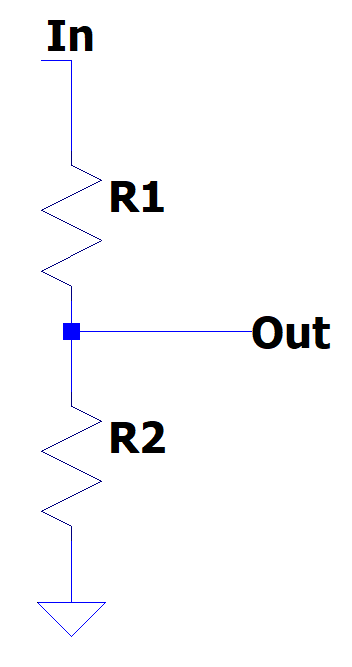
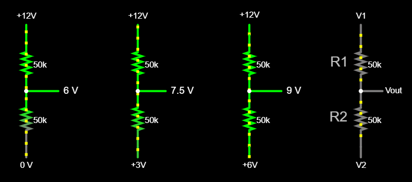
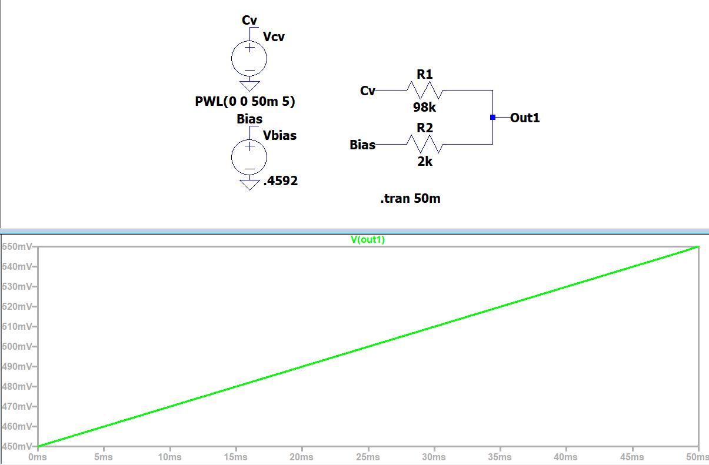

While the VCO works with a variable power supply, it's not ready to integrate with the rest of a system until it can accept a standard range of voltages — we specified 0-5V as our constraint for control voltage (CV) signals. Right now, the oscillator only works within a narrow range ~ [450mV, 550mV]. An input of 5V would cause the BJT to drain the capacitor faster than it can charge; conversely, an input of 0V would cause the capacitor to never discharge at all. To accept CV, we need to convert a 0-5V input into 450-550mV.

Mathematically speaking, converting an input in range x=[0, 5] to y=[0.450, 0.550] is a linear conversion satisfied by the line 

$$y=0.02x+0.450$$

Therefore, we can achieve this same conversion in our circuit by:

1. Scaling [0V, 5V] by a factor of 0.02x to span [0V, 100mV] 
2. Adding an offset of 450mV

One way to do this is via a _passive mixer_, which outputs a weighted average of multiple inputs. Our first input will be the full CV input (0-5 V), while our second input will be a constant DC voltage offset. Surprisingly, a voltage divider provides this functionality.

### Passive Mixing
Typically, a [voltage divider]() is considered with a single input, and the other end is connected to 0V (GND). This simplifies the equation to the familiar

$$V_{out} = V_{in} \frac{R_2}{R_1 + R_2}$$

where the output voltage is proportional to the ratio of the two resistors.

_Single-input voltage divider._

However, while a voltage divider is typically designed to drop voltage from some input voltage to GND, in theory all that is required for its operation is a _difference_ in voltages. Similar to how ziplining from 100m to 0m works pretty much the same as from 500m to 400m, or 1500m to 1400m, there's no reason that the bottom resistor _must_ be connected to GND. The output is still proportionally placed, only relative to the new voltages (elevations) at either endpoint.

_[[Falstad]](https://tinyurl.com/2qb6me2t)_

This changes the voltage divider equation somewhat, and reveals that the previous formulation has been a simplification which only applies when one input is grounded. The full equation, which [can be derived](proof-dual-voltage-div.md), is

$$V_{out} = V_1\frac{R_1}{R_1+R_2} + V_2\frac{R_2}{R_1 + R_2}$$

When resistances are equal, the output voltage of a two-input voltage divider is simply the average of the two inputs. Changing the ratio of the resistors (by allowing R1 ≠ R2) shifts the midpoint "away" from the larger resistance, weighting one input more heavily than the other. This forms the principle behind passive mixing. Importantly, each ratio $\frac{R_1}{R_1+R_2}$ and $\frac{R_2}{R_1+R_2}$ forms a simple percentage (0-100%) which scales each voltage ($V_1$ or $V_2$), and these percentages _must_ add up to 100%. If $V_1$ contributes by 25% to the output voltage, $V_2$ must contribute the remaining 75%. 

_A voltage divider is a 2-input passive mixer. We can change the input voltages or the resistor ratios, or both. In all cases, each output is a weighted average of the two input voltages. [[Falstad]](https://tinyurl.com/2ndekrlo)_

We can applying passive mixing to our circuit to "scale and shift" the CV input.

 Recall that our desired output range (450mV - 550mV) is 0.02x, or $\frac{2}{100}$, of our input (0-5 V). This means that our other input, which we'll call the "bias", must contribute 98% of its value to the output. Therefore:

$$V_{out} = V_{CV} \frac{R_{bias}}{R_{CV} + R_{bias}} + V_{bias} \frac{R_{CV}}{R_{CV} + R_{bias}}$$

$$\implies V_{out} = V_{CV}(\frac{2}{100}) + V_{bias}(\frac{98}{100})$$

This implies that the resistors must be sized to maintain this ratio: We'll choose $R_{bias} = 98k\Omega$ and $R_{CV} = 2k\Omega$.

Although we don't know the Bias voltage, we know the output that we want when $V_{CV}$ = 0V or 5V. We can choose to solve for voltage in either:

$$ 
\left\{
    \begin{array}{l}
      450\text{mV} = (0V)\frac{2k\Omega}{2k\Omega+98k\Omega} + V_{bias}\frac{98k\Omega}{2k\Omega+98k\Omega}\\
      \\
      550\text{mV} = (5V)\frac{2k\Omega}{2k\Omega+98k\Omega} + V_{bias}\frac{98k\Omega}{2k\Omega+98k\Omega}
    \end{array}
  \right.$$

Using LTSpice allows us to confirm this is true. We can set the CV input to range between [0V, 5V] for 0-50ms, observing the output at each point. 

We can buffer this output before passing it to the BJT base, and have successfully ensured that any valid CV input (0-5V) will work with our oscillator.

> Falstad simulator is a powerful and quick tool to use for most simulation. However, when you need to do an analysis that _doesn't_ involve time — for example, we want to see the output for changing _voltage_ input — LTSpice is a clear winner over Falstad.
